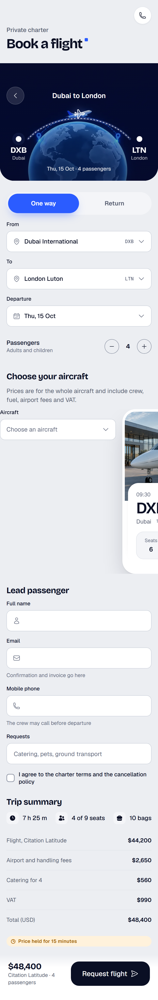
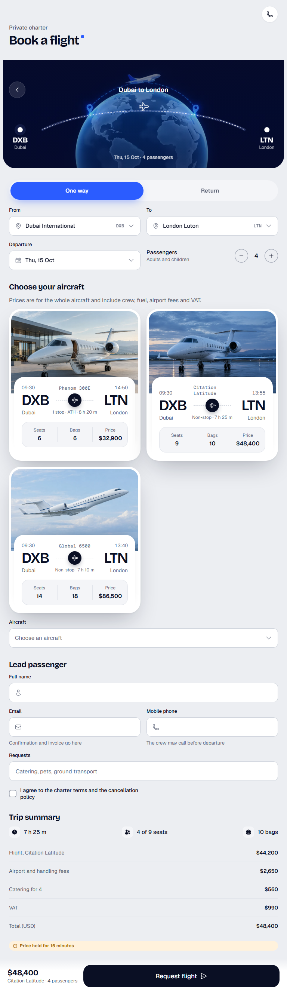
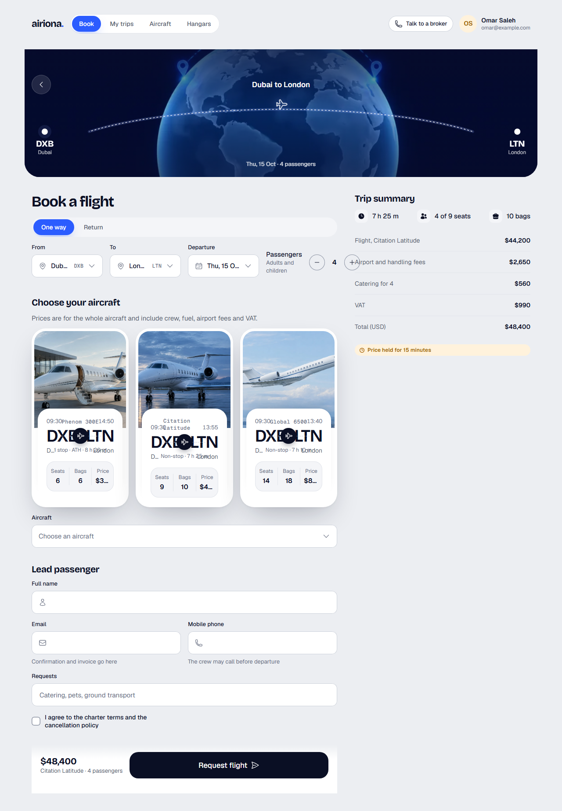
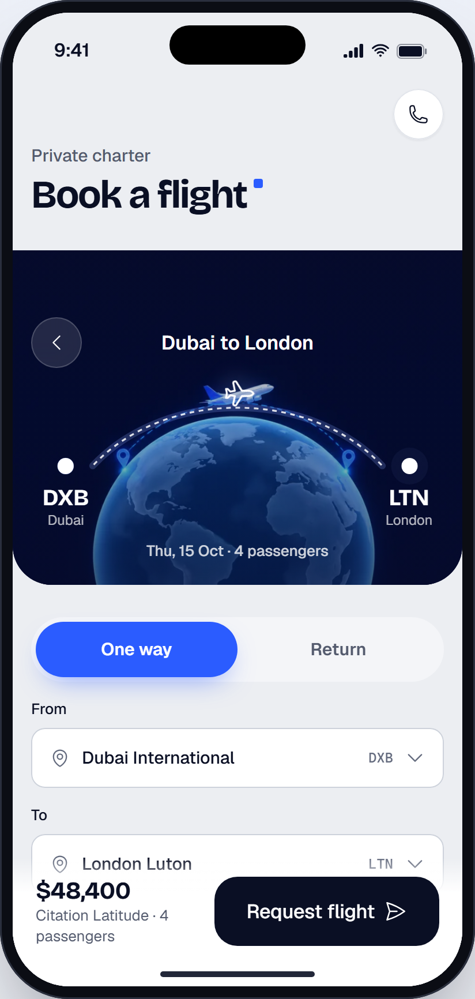

# Book a flight

> Generated from `docs/pages/flight-booking/page.spec.json` by `node tools/page/airiona.mjs render flight-booking`. Edit the spec, not this file.

| | |
|---|---|
| Audience | A client (often an assistant booking for someone) on a phone or laptop, who knows the route and date and wants the right aircraft at a clear all-in price |
| Primary action | Request the flight on the chosen aircraft |
| Source | brief |
| Route | `/book` (playground: `#/flight-booking`) |
| Framework | angular |

The central page of the product: a client books a private flight from A to B. One page carries the whole booking: route, trip details, aircraft offers for that route, the chosen aircraft, the lead passenger and the request. Prices are quoted per aircraft for the whole flight; the booking is a request the operator confirms, paid by invoice or card after confirmation (no card entry on this page).

## Screens

| 390 px (phone) | 768 px (tablet) | 1280 px (desktop) |
|---|---|---|
|  |  |  |

App view (the page in app mode inside the phone frame, `#/native/flight-booking`):



Page checks (`shoot`): 0 errors, 0 warnings. Spec check (`lint`) is at the end of this document.

## Layout, mobile first

| Section | Purpose | 390 | 768 | 1280 | Sticky | Notes |
|---|---|---|---|---|---|---|
| **Site navigation** `nav` | Desktop navigation | stack | ↑ | ↑ |  | hidden at base |
| **Book a flight** `topbar` | Phone title and broker shortcut | stack | ↑ | ↑ |  | hidden at lg |
| **Your route** `route` | The A to B the whole page is about, shown as the route arc | stack | ↑ | ↑ |  |  |
| **Trip** `trip` | Where, when and how many: changing any of it refreshes the offers | stack | grid-2 | grid-4 |  |  |
| **Choose your aircraft** `offers` | Aircraft that can fly this route on that date, with all-in prices | scroll-x | grid-2 | grid-3 |  |  |
| **Lead passenger** `passenger` | Who flies and how the operator reaches them | stack | grid-2 | ↑ |  |  |
| **Trip summary** `summary` | What the request costs; beside the form on desktop | stack | ↑ | ↑ (aside) |  |  |
| **Request** `request` | The total and the request button, always in reach on phones | stack | ↑ | ↑ | base: bottom, lg: none |  |

## Components

### Site navigation

| Element | Component | Inputs | Data | Why this one | States |
|---|---|---|---|---|---|
| `topNav` | TopNav `ar-top-nav` | `links`=[{"value":"book","label":"Book"},{"value":"trips","label":"M<br>`value`=book<br>`user`={"name":"Omar Saleh","email":"omar@example.com"} |  | The product's four destinations with the signed-in client |  |
| `navHelp` [arActions] | Button `button[arButton], a[arButton]` | `variant`=secondary<br>`size`=sm<br>`iconStart`=phone |  | Charter clients expect a human; replaces TopNav's default search and bell |  |

### Book a flight

| Element | Component | Inputs | Data | Why this one | States |
|---|---|---|---|---|---|
| `appBar` | AppBar `ar-app-bar` | `title`=Book a flight<br>`large`=true<br>`eyebrow`=Private charter<br>`accent`=true |  | Root screen of the Book tab: large title (the page h1 on phones and tablets) |  |
| `callBroker` [arActions] | IconButton `button[arIconButton]` | `icon`=phone<br>`label`=Talk to a broker<br>`variant`=surface |  | One-tap call to a broker |  |

### Your route

| Element | Component | Inputs | Data | Why this one | States |
|---|---|---|---|---|---|
| `routeHeader` | RouteHeader `ar-route-header` | `title`=Dubai to London<br>`image`=assets/art/route-globe.webp | `from` ← `quote.from`<br>`to` ← `quote.to`<br>`meta` ← `quote.summary` | The system's route header: both airports, the arc between them and the trip line; it makes the A to B the hero<br>Not HeroHeader: no route; a generic headline panel |  |

### Trip

| Element | Component | Inputs | Data | Why this one | States |
|---|---|---|---|---|---|
| `desktopTitle` | `<h1>` |  |  |  |  |
| `tripType` (field `tripType`) | MobileSegmented `ar-mobile-segmented` | `tone`=brand<br>`options`=[{"value":"one","label":"One way"},{"value":"return","label" |  | Two always-visible options with a thumb-sized switch on phones |  |
| `tripTypeDesktop` (field `tripType`) | SegmentedControl `ar-segmented-control` | `tone`=brand<br>`options`=[{"value":"one","label":"One way"},{"value":"return","label" |  | Compact pill group above the trip row on desktop; same form control |  |
| `from` (field `from`) | Select `ar-select` | `searchable`=true<br>`searchPlaceholder`=City or airport code<br>`iconStart`=map-pin<br>`emptyText`=No airport matches that. | `options` ← `airports` | One airport from many; searchable by city or IATA code |  |
| `to` (field `to`) | Select `ar-select` | `searchable`=true<br>`searchPlaceholder`=City or airport code<br>`iconStart`=map-pin<br>`emptyText`=No airport matches that. | `options` ← `airports` | Same control as From so the pair reads as one route |  |
| `departure` (field `departure`) | DatePicker `ar-date-picker` | `mode`=single<br>`min`=2026-10-04<br>`presets`=[{"label":"Tomorrow","value":"2026-10-04"},{"label":"This Fr |  | One departure date with quick presets; a charter can leave any day<br>Not Calendar: an inline month takes the phone screen |  |
| `passengers` (field `passengers`) | QuantityStepper `ar-quantity-stepper` | `description`=Adults and children<br>`min`=1<br>`max`=19 |  | A bounded count; the maximum is the largest cabin offered |  |

### Choose your aircraft

| Element | Component | Inputs | Data | Why this one | States |
|---|---|---|---|---|---|
| `offer` | FlightTicket `ar-flight-ticket` |  | `image` ← `item.image`<br>`from` ← `item.from`<br>`to` ← `item.to`<br>`flight` ← `item.aircraft`<br>`airline` ← `item.operator`<br>`cabin` ← `item.category`<br>`duration` ← `item.duration`<br>`details` ← `item.details` | The flight card with the aircraft photo on top: for charter the aircraft is the product, so the photo stays (unlike scheduled-flight results)<br>Not TicketCard: no photo and fare-style, for scheduled seats<br>Not StayCard: no route line |  |
| `aircraft` (field `aircraft`) | Select `ar-select` |  | `options` ← `aircraftOptions` | The choice itself: one of the offers, with route, seats and price in each option; cards above show the aircraft |  |

### Lead passenger

| Element | Component | Inputs | Data | Why this one | States |
|---|---|---|---|---|---|
| `fullName` (field `fullName`) | TextField `ar-text-field` | `iconStart`=user |  | Name as on the passport, for the manifest |  |
| `email` (field `email`) | TextField `ar-text-field` | `iconStart`=envelope<br>`hint`=Confirmation and invoice go here |  | Email keyboard and autofill |  |
| `phone` (field `phone`) | TextField `ar-text-field` | `iconStart`=phone<br>`hint`=The crew may call before departure |  | Phone keyboard and autofill |  |
| `requests` (field `requests`) | TextField `ar-text-field` | `placeholder`=Catering, pets, ground transport |  | Free text for the operator; optional |  |
| `terms` (field `terms`) | Checkbox `ar-checkbox` |  |  | Explicit agreement to the charter terms (requiredTrue) |  |

### Trip summary

| Element | Component | Inputs | Data | Why this one | States |
|---|---|---|---|---|---|
| `flightFacts` | InfoStatRow `ar-info-stat-row` | `items`=[{"icon":"clock","label":"7 h 25 m"},{"icon":"users","label" |  | The three numbers clients ask first |  |
| `priceLines` | DetailList `ar-detail-list` |  | `items` ← `quote.priceLines` | Label and value rows for the all-in price, total last |  |
| `hold` | Badge `ar-badge` | `tone`=warning<br>`icon`=clock |  | Charter prices move; the hold explains the urgency without pressure |  |

### Request

| Element | Component | Inputs | Data | Why this one | States |
|---|---|---|---|---|---|
| `requestBar` | StickyActionBar `ar-sticky-action-bar` |  |  | The system's bottom CTA: price summary plus one 60px button |  |
| `requestTotal` [arSummary] | `<strong>` |  |  |  |  |
| `requestAircraft` [arSummary] | `<span>` |  |  |  |  |
| `requestButton` | Button `button[arButton], a[arButton]` | `variant`=primary<br>`size`=lg<br>`iconEnd`=paper-airplane |  | The one primary action; the operator confirms within the hold |  |

## Forms and validation

### booking

Submit: **Request flight** → POST /api/charter/requests { offerId, tripType, from, to, departure, passengers, leadPassenger, requests }. Success: burst (“You're flying to London”). Failure: Offer no longer available (410): Toast 'That aircraft was just booked' and the offers refresh; any other error: danger Toast with Retry and the form kept.

Errors show after a field is left or on submit; submit focuses the first invalid field.

| Field | Control | Default | Rules | Messages | Keyboard / autofill |
|---|---|---|---|---|---|
| **Trip type** `tripType` | MobileSegmented,SegmentedControl | one | required | required: “Choose one way or return.” |  |
| **From** `from` | Select | DXB | required | required: “Choose where you fly from.” |  |
| **To** `to` | Select | LTN | required | required: “Choose where you fly to.” |  |
| **Departure** `departure` | DatePicker | 2026-10-15 | required, futureDate | required: “Choose a departure date.”<br>futureDate: “Departure can't be in the past.” |  |
| **Passengers** `passengers` | QuantityStepper | 4 | min(1), max(19) | min: “At least one passenger flies.”<br>max: “For more than 19 passengers, talk to a broker.” |  |
| **Aircraft** `aircraft` | Select |  | required | required: “Choose the aircraft you want.” |  |
| **Full name** `fullName` | TextField |  | required, minLength(3), maxLength(80) | required: “Enter the lead passenger's name as on the passport.”<br>minLength: “Enter the full name.”<br>maxLength: “Use at most 80 characters.” | autocomplete=name |
| **Email** `email` | TextField |  | required, email | required: “Enter an email for the confirmation.”<br>email: “Enter an email like name@example.com.” | type=email, autocomplete=email, inputMode=email |
| **Mobile phone** `phone` | TextField |  | required, phone | required: “Enter a phone number the crew can reach.”<br>phone: “Enter a phone number with country code, like +971 50 123 4567.” | type=tel, autocomplete=tel, inputMode=tel |
| **Requests** `requests` | TextField |  | maxLength(500) | maxLength: “Keep requests under 500 characters.” | autocomplete=off |
| **I agree to the charter terms and the cancellation policy** `terms` | Checkbox | false | requiredTrue | requiredTrue: “Tick to agree before requesting.” |  |

## Data

- **airports**: `Airport[]` from GET /api/airports?query= (searchable, nearest first). Loading: Select shows 'Searching airports…'. Empty: Select empty text: 'No airport matches that. Try the city or the IATA code.'. Error: Select hint: 'Airports could not load. Type the IATA code.'.
- **offers**: `Offer[]` from GET /api/charter/offers?from&to&date&passengers. Loading: Three Skeleton cards in the offer layout. Empty: No aircraft can fly this route on that date. Try the day before or after, or a nearby airport.. Error: Toast 'Offers could not load' with Retry; the trip form stays as typed.
- **aircraftOptions**: `AircraftOption[]` from derived from offers. Loading: Select disabled until offers load. Empty: Select hidden when there are no offers. Error: as offers.
- **quote**: `Quote` from POST /api/charter/quote { offerId, passengers } (recomputed when the aircraft or passengers change). Loading: Price lines show Skeleton rows; the request button stays disabled. Empty: —. Error: Toast 'We could not price this trip' with Retry.

```ts
interface Airport {
  value: string;
  label: string;
  meta: string;
}
interface Endpoint {
  code: string;
  city: string;
  time: string;
}
interface Fact {
  label: string;
  value: string;
}
interface Offer {
  id: string;
  aircraft: string;
  category: string;
  operator: string;
  image: string;
  from: Endpoint;
  to: Endpoint;
  duration: string;
  details: Fact[];
}
interface AircraftOption {
  value: string;
  label: string;
  description: string;
  meta: string;
}
interface RouteEnd {
  code: string;
  city: string;
}
interface Quote {
  from: RouteEnd;
  to: RouteEnd;
  summary: string;
  priceLines: Fact[];
  total: string;
}
```

Sample data: `projects/playground/src/app/pages/flight-booking/flight-booking.data.ts`.

## Motion

| Where | Use | Why |
|---|---|---|
| Arriving from search or the home page | RouteTransition (fade-through) | Top-level destination |
| Offers after the trip changes | Skeleton | Offers load in place without the layout jumping |
| After the request is sent | SuccessBurst | The one celebration at the end of the booking |

Everything settles instantly under `prefers-reduced-motion` or `provideAiriona({ motion: 'reduce' })`.

## Accessibility

- One h1: AppBar large title on phones and tablets, the visible 'Book a flight' heading on desktop.
- The offer carousel on phones is a scrollable region; each card names the aircraft, operator and price in text.
- Submit moves focus to the first invalid field; the success dialog takes focus and returns it to the request button when closed.

## Notes

- Phone order: title, route, trip details, aircraft offers (swipe), the aircraft choice, lead passenger, price summary, sticky request bar. Desktop: route full width, then the form on the left and the price summary sticky on the right.
- Return trips add a return date field and a second leg on each offer; the sample shows one way.
- The request bar total follows the selected aircraft (quote.total); the sample shows the midsize offer.
- No card entry here: charter is confirmed by the operator first, then paid by invoice or card link.

## Spec check

✅ No errors


## Build it

```bash
node tools/page/airiona.mjs check flight-booking   # lint, handoff, scaffold, build, screenshots
npx ng serve playground                    # then open http://localhost:4200/#/flight-booking
```

Generated code: `projects/playground/src/app/pages/flight-booking/`. Copy that folder into the product app with `shared/page-form.ts` and `shared/validators.ts`, then replace the sample data with the real sources listed above.
