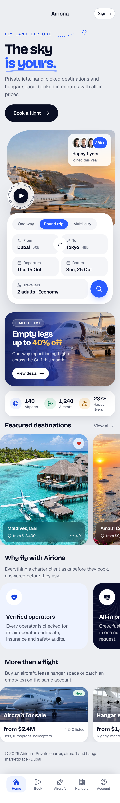
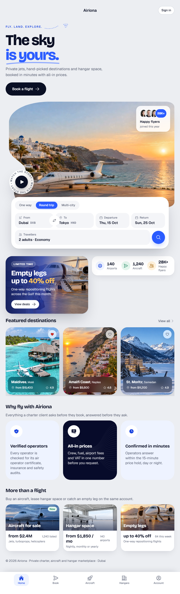
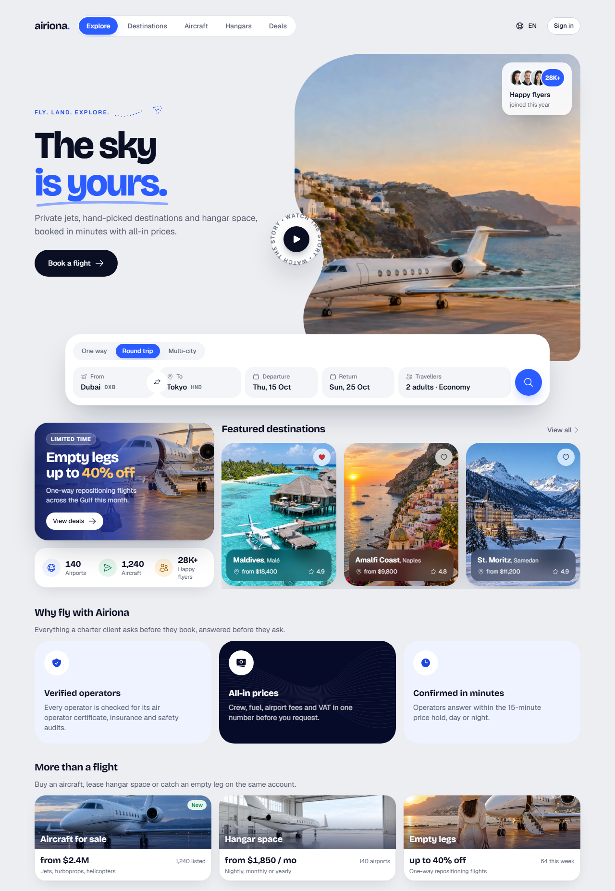
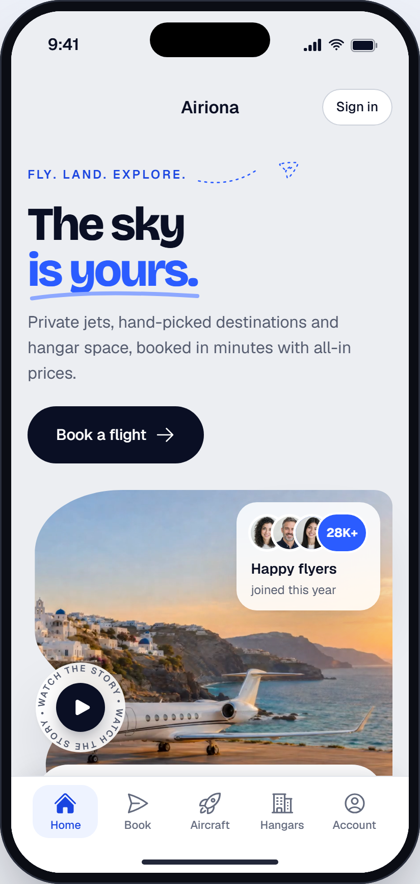

# Home

> Generated from `docs/pages/flight-home/page.spec.json` by `node tools/page/airiona.mjs render flight-home`. Edit the spec, not this file.

| | |
|---|---|
| Audience | Someone planning a private flight, buying an aircraft or looking for hangar space, landing here from search or an ad. Often on a phone; they decide in seconds whether Airiona is premium and trustworthy, then search a route. |
| Primary action | Search a route and open the booking page |
| Source | screenshot · `docs/pages/flight-home/source.png` |
| Route | `/flight-home` (playground: `#/flight-home`) |
| Framework | angular |

The product owner's chosen landing reference (a travel brand, 'Travorra'). Desktop only. It has a top bar with the logo, five centred links with a dot under the active one, a language switch and a round menu button. The hero has an uppercase eyebrow with a dashed plane trail, a two-line serif headline whose second line is italic blue, a lede, and a 'Start Exploring' pill with an arrow disc. On the right is a coastal photo in an organic shape with a curved bite on the left edge, a 'watch travel story' ring play button sitting in that bite, and a glass 'Happy Travelers 28K+' card with faces on the top right. A white search pill spans the hero's bottom edge (Where to, Check in, Check out, Travelers, round search button). Below it are a blue 'Limited time offer, Get up to 30% off' photo card and a three-figure stats card on the left, and 'Featured destinations' with View all, four tall photo cards (heart, name, from price, rating chip) and prev/next arrows on the right. The owner's instruction: keep the hero style, apply Airiona's style, use our components, and make the hero photo a still frame that becomes a running video after load. Phone layout, states, the sections below the fold and all copy are designed here for Airiona (private charter, aircraft and hangar marketplaces).

## Screens

| 390 px (phone) | 768 px (tablet) | 1280 px (desktop) |
|---|---|---|
|  |  |  |

App view (the page in app mode inside the phone frame, `#/native/flight-home`):



Page checks (`shoot`): 0 errors, 0 warnings. Spec check (`lint`) is at the end of this document.

## Layout, mobile first

| Section | Purpose | 390 | 768 | 1280 | Sticky | Notes |
|---|---|---|---|---|---|---|
| **Airiona** `topbar` | Phone brand bar with sign in; the link row does not fit 390px | stack | ↑ | ↑ |  | hidden at lg |
| **Site navigation** `nav` | The reference's top bar: brand, links, language and sign in | stack | ↑ | ↑ |  | hidden at base |
| **The sky is yours** `hero` | The reference hero in Airiona style: the promise, proof, the story film and the route search on the first screen | stack | ↑ | ↑ |  |  |
| **Offers and featured destinations** `offers` | The reference's second band: the offer and proof on the left, featured destinations on the right | stack | ↑ | sidebar |  |  |
| **Why fly with Airiona** `why` | Trust: the three promises behind the price | scroll-x | grid-3 | ↑ |  |  |
| **More than a flight** `markets` | Doors into the aircraft and hangar marketplaces | scroll-x | grid-3 | ↑ |  |  |
| **Footer** `footer` | Brand line and legal | stack | row | ↑ |  |  |
| **Tabs** `tabs` | Phone and tablet app navigation, always in thumb reach | stack | ↑ | ↑ | base: bottom, lg: none | hidden at lg |

## Components

### Airiona

| Element | Component | Inputs | Data | Why this one | States |
|---|---|---|---|---|---|
| `appBar` | AppBar `ar-app-bar` | `title`=Airiona |  | A compact bar on phones: the hero below carries the h1, so the bar stays small |  |
| `appBarSignIn` [arActions] | Button `button[arButton], a[arButton]` | `variant`=secondary<br>`size`=sm |  | Returning clients sign in from the top right |  |

### Site navigation

| Element | Component | Inputs | Data | Why this one | States |
|---|---|---|---|---|---|
| `topNav` | TopNav `ar-top-nav` | `links`=[{"value":"explore","label":"Explore"},{"value":"destination<br>`value`=explore |  | The reference's centred link row with the active state, in Airiona's pill navigation |  |
| `navLanguage` [arActions] | Button `button[arButton], a[arButton]` | `variant`=ghost<br>`size`=sm<br>`iconStart`=globe-alt |  | The reference's language switch |  |
| `navSignIn` [arActions] | Button `button[arButton], a[arButton]` | `variant`=secondary<br>`size`=sm |  | Sign in replaces the reference menu disc: the links are already visible at 1280 |  |

### The sky is yours

| Element | Component | Inputs | Data | Why this one | States |
|---|---|---|---|---|---|
| `splitHero` | SplitHero `ar-split-hero` | `eyebrow`=Fly. Land. Explore.<br>`title`=The sky<br>`accent`=is yours.<br>`lede`=Private jets, hand-picked destinations and hangar space, boo<br>`image`=assets/photos/aviation/landing-hero.webp<br>`video`=assets/video/landing-hero.mp4<br>`focus`=42% 50%<br>`badge`={"value":"28K+","title":"Happy flyers","text":"joined this y<br>`storyLabel`=Watch the story<br>`headingLevel`=1<br>`docked`=true |  | SplitHero is this reference's hero: two-part display headline with the accent line, a photo in the organic shape that starts as a still frame and turns into the looping video after load, the glass travellers badge and the story ring button; docked children straddle its bottom edge like the reference search pill<br>Not LandingHero: full-bleed photo with copy on top; the reference splits copy and photo side by side<br>Not HeroHeader: compact mobile header, no video, no badge |  |
| `heroBook` [arActions] | Button `button[arButton], a[arButton]` | `variant`=primary<br>`size`=lg<br>`iconEnd`=arrow-right |  | The reference's Start Exploring pill: the one primary action, straight to the booking page |  |
| `heroSearch` | BookingSearch `ar-booking-search` |  |  | The reference's search pill: trip type, From ⇄ To, dates and travellers with the brand search disc, the system's flight search<br>Not html card with Select and DatePicker fields: the reference is a single compact bar; BookingSearch is that bar and opens each picker from its tile |  |

### Offers and featured destinations

| Element | Component | Inputs | Data | Why this one | States |
|---|---|---|---|---|---|
| `offerColumn` | `<div>` |  |  | Offer and proof stack beside the destinations at 1280, side by side on tablets |  |
| `promo` | PromoBanner `ar-promo-banner` | `image`=assets/photos/aviation/promo-jet.webp<br>`eyebrow`=Limited time<br>`title`=Empty legs up to<br>`highlight`=40% off<br>`text`=One-way repositioning flights across the Gulf this month.<br>`action`=View deals |  | The reference's limited-offer photo card<br>Not FeatureCard: no photo; the reference card is a photo with a blue fade |  |
| `stats` | StatStrip `ar-stat-strip` | `label`=Airiona in numbers<br>`items`=[{"icon":"globe-alt","value":"140","label":"Airports"},{"ico |  | The reference's three proof figures with tinted icon discs |  |
| `featuredColumn` | `<div>` |  |  | Heading and cards as one column |  |
| `featuredHead` | SectionHeader `ar-section-header` | `title`=Featured destinations<br>`action`=View all<br>`chevron`=true |  | Title with the reference's View all link |  |
| `featuredGrid` | `<div>` |  |  | The reference carousel: one card and a peek on phones, three per view from tablets up, swiping sideways |  |
| `destination` | PlaceCard `ar-place-card` |  | `title` ← `item.title`<br>`region` ← `item.region`<br>`location` ← `item.location`<br>`rating` ← `item.rating`<br>`image` ← `item.image`<br>`saved` ← `item.saved` | The reference's tall photo card with a heart, the name, a from-price and the rating<br>Not DestinationCard: adds a Book now button the reference cards do not have |  |

### Why fly with Airiona

| Element | Component | Inputs | Data | Why this one | States |
|---|---|---|---|---|---|
| `whyVerified` | FeatureCard `ar-feature-card` | `icon`=shield-check<br>`title`=Verified operators<br>`text`=Every operator is checked for its air operator certificate, <br>`tone`=light |  | Icon, title and two lines: one promise per card |  |
| `whyPrice` | FeatureCard `ar-feature-card` | `icon`=banknotes<br>`title`=All-in prices<br>`text`=Crew, fuel, airport fees and VAT in one number before you re<br>`tone`=dark |  | The middle promise in the dark tone draws the eye to price, the first question |  |
| `whyFast` | FeatureCard `ar-feature-card` | `icon`=clock<br>`title`=Confirmed in minutes<br>`text`=Operators answer within the 15-minute price hold, day or nig<br>`tone`=light |  | Speed is the third question |  |

### More than a flight

| Element | Component | Inputs | Data | Why this one | States |
|---|---|---|---|---|---|
| `market` | MiniDestination `ar-mini-destination` |  | `title` ← `item.title`<br>`image` ← `item.image`<br>`price` ← `item.price`<br>`duration` ← `item.duration`<br>`dates` ← `item.dates`<br>`badge` ← `item.badge` | Compact photo cards with three short facts; each opens its marketplace |  |

### Footer

| Element | Component | Inputs | Data | Why this one | States |
|---|---|---|---|---|---|
| `footerLine` | `<p>` |  |  |  |  |

### Tabs

| Element | Component | Inputs | Data | Why this one | States |
|---|---|---|---|---|---|
| `tabBar` | TabBar `ar-tab-bar` | `items`=[{"value":"home","label":"Home","icon":"home"},{"value":"boo<br>`value`=home<br>`variant`=labels<br>`label`=Main |  | Home is the root of the app; the tab bar is how a phone app moves between its five destinations |  |

## Data

- **destinations**: `Destination[]` from GET /api/destinations/featured (six, ranked by bookings this season). Loading: Six PlaceCard skeletons. Empty: Section hidden. Error: Section hidden; the search still works.
- **marketplaces**: `Tile[]` from Static: the three Airiona marketplaces with live counts from GET /api/marketplace/summary. Loading: Three MiniDestination skeletons. Empty: Section hidden. Error: Section hidden.

```ts
interface Destination {
  title: string;
  region: string;
  location: string;
  rating: string;
  image: string;
  saved: boolean;
}
interface Tile {
  title: string;
  image: string;
  price: string;
  duration: string;
  dates: string;
  badge: string?;
}
```

Sample data: `projects/playground/src/app/pages/flight-home/flight-home.data.ts`.

## Motion

| Where | Use | Why |
|---|---|---|
| Arriving from another tab or the sign-in | RouteTransition (fade-through) | Top-level destination |

Everything settles instantly under `prefers-reduced-motion` or `provideAiriona({ motion: 'reduce' })`.

## Accessibility

- One h1: "The sky is yours." (the SplitHero title and accent are one heading). The AppBar title is not a heading; sections use h2.
- The hero video is decorative: muted, aria-hidden, no controls; it never plays under reduced motion or data saver. The ring button is labelled "Watch the story" and opens the film with controls.
- The search tiles are buttons that name their field and value; the search disc is labelled Search flights.
- Destination cards are buttons named by the destination; the heart says Save or Remove from saved.
- The tab bar is a nav landmark labelled Main, hidden at 1280 where the top navigation takes over.

## Gaps

| Element | Need | Nearest today | Proposal |
|---|---|---|---|
| featuredGrid | Prev/next arrow buttons beside the carousel, as in the reference | SnapCarousel (snap and peek, no arrows); scroll-x layout | Add an `arrows` input to SnapCarousel: two IconButtons that scroll by one card and disable at the ends |

## Notes

- Style: Airiona's own type (Bricolage Grotesque display, Geist text) replaces the reference serif; the italic accent line becomes the Ion Blue accent with a hand-drawn underline. Colours, radii and shadows are the system's.
- Hero frame and video: the photo is the first frame of a 5.25s seamless loop generated from it; the video fades in 1200ms after load, so the first paint is the still frame and the page never waits on video.
- Copy is Airiona's: the reference is a travel brand; the figures (140 airports, 1,240 aircraft, 28K+ flyers) match the marketplace pages.
- Phone order: brand bar, hero (copy, photo, search docked over its edge), offer and stats, featured destinations (swipe), why Airiona, marketplaces, footer, tab bar.

## Spec check

✅ No errors


## Build it

```bash
node tools/page/airiona.mjs check flight-home   # lint, handoff, scaffold, build, screenshots
npx ng serve playground                    # then open http://localhost:4200/#/flight-home
```

Generated code: `projects/playground/src/app/pages/flight-home/`. Copy that folder into the product app with `shared/page-form.ts` and `shared/validators.ts`, then replace the sample data with the real sources listed above.
