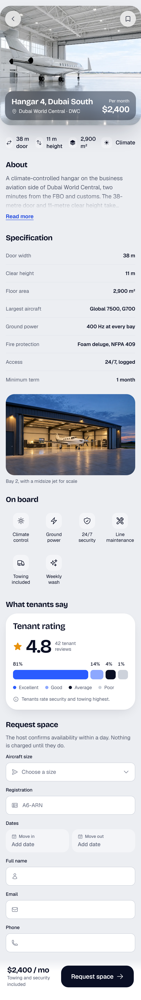
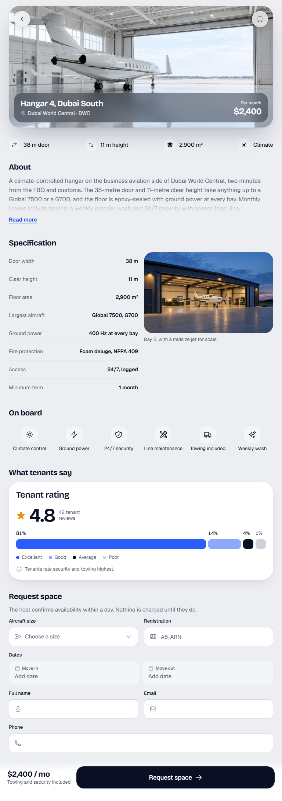
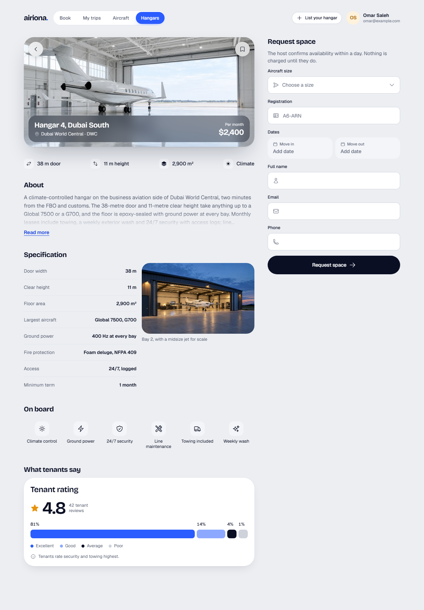
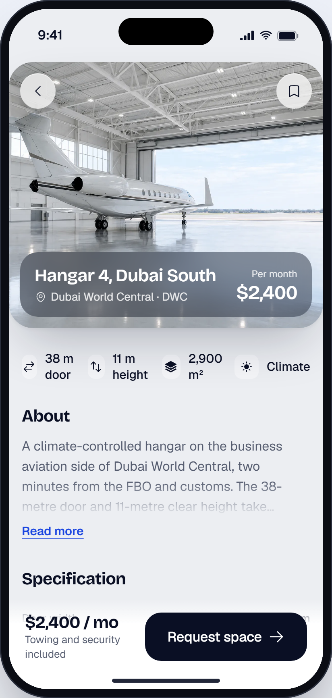

# Hangar

> Generated from `docs/pages/hangar-detail/page.spec.json` by `node tools/page/airiona.mjs render hangar-detail`. Edit the spec, not this file.

| | |
|---|---|
| Audience | An owner or flight department manager checking whether one hangar fits their aircraft and dates, usually on a phone. |
| Primary action | Request hangar space |
| Source | brief · `product brief: Airiona aircraft and hangar marketplaces` |
| Route | `/hangar-detail` (playground: `#/hangar-detail`) |
| Framework | angular |

The detail page behind one hangar listing card: photo, key facts, description, specification, amenities and a contact form that stays in reach on phones.

## Screens

| 390 px (phone) | 768 px (tablet) | 1280 px (desktop) |
|---|---|---|
|  |  |  |

App view (the page in app mode inside the phone frame, `#/native/hangar-detail`):



Page checks (`shoot`): 0 errors, 0 warnings. Spec check (`lint`) is at the end of this document.

## Layout, mobile first

| Section | Purpose | 390 | 768 | 1280 | Sticky | Notes |
|---|---|---|---|---|---|---|
| **Site navigation** `nav` | Desktop navigation: the product destinations and the signed-in account | stack | ↑ | ↑ |  | hidden at base |
| **Hangar 4, Dubai South** `hero` | The listing photo with the name, base and price | stack | ↑ | ↑ |  |  |
| **Key facts** `facts` | The four numbers buyers check first | stack | ↑ | ↑ |  |  |
| **About** `about` | The seller description, clamped on phones | stack | ↑ | ↑ |  |  |
| **Specification** `specs` | Every figure a buyer or broker compares | stack | grid-2 | ↑ |  |  |
| **On board** `amenities` | What comes with it | stack | ↑ | ↑ |  |  |
| **What tenants say** `reviews` | Trust from people who parked here | stack | ↑ | ↑ |  |  |
| **Request space** `contact` | Reach the seller or host; beside the details on desktop | stack | grid-2 | stack (aside) |  |  |
| **Send** `cta` | Price and the one action, always in reach on phones | stack | ↑ | ↑ | base: bottom | hidden at lg |

## Components

### Site navigation

| Element | Component | Inputs | Data | Why this one | States |
|---|---|---|---|---|---|
| `topNav` | TopNav `ar-top-nav` | `links`=[{"value":"book","label":"Book"},{"value":"trips","label":"M<br>`value`=hangars<br>`user`={"name":"Omar Saleh","email":"omar@example.com"} |  | The product's four destinations with the signed-in account; replaces the phone tab bar at 1280 |  |
| `navAction` [arActions] | Button `button[arButton], a[arButton]` | `variant`=secondary<br>`size`=sm<br>`iconStart`=plus |  | The host door stays in the header |  |

### Hangar 4, Dubai South

| Element | Component | Inputs | Data | Why this one | States |
|---|---|---|---|---|---|
| `pageTitle` | `<h1>` |  |  |  |  |
| `placeHero` | PlaceHero `ar-place-hero` | `title`=Hangar 4, Dubai South<br>`location`=Dubai World Central · DWC<br>`price`=$2,400<br>`priceLabel`=Per month<br>`image`=assets/photos/aviation/hangar-large.webp |  | Full-width photo with glass back and bookmark buttons and a plate with the name, place and price: the system detail header<br>Not LandingHero: a page-opening marketing hero, not a listing photo |  |

### Key facts

| Element | Component | Inputs | Data | Why this one | States |
|---|---|---|---|---|---|
| `factRow` | InfoStatRow `ar-info-stat-row` | `items`=[{"icon":"arrows-right-left","label":"38 m door"},{"icon":"a |  | Icon and short label in one row, scannable at a glance |  |

### About

| Element | Component | Inputs | Data | Why this one | States |
|---|---|---|---|---|---|
| `aboutText` | ExpandableText `ar-expandable-text` | `lines`=4 |  | Long seller copy clamped to four lines with Read more |  |

### Specification

| Element | Component | Inputs | Data | Why this one | States |
|---|---|---|---|---|---|
| `specList` | DetailList `ar-detail-list` | `items`=[{"label":"Door width","value":"38 m"},{"label":"Clear heigh |  | Label and value rows, the system way to list facts |  |
| `photo` | `<figure>` |  |  |  |  |
| `photoImg` | `` |  |  |  |  |
| `photoCaption` | `<figcaption>` |  |  |  |  |

### On board

| Element | Component | Inputs | Data | Why this one | States |
|---|---|---|---|---|---|
| `amenityList` | AmenityList `ar-amenity-list` | `items`=[{"icon":"sun","label":"Climate control"},{"icon":"bolt","la |  | Icon tiles summing up the facilities, 4–6 items |  |

### What tenants say

| Element | Component | Inputs | Data | Why this one | States |
|---|---|---|---|---|---|
| `rating` | RatingBreakdown `ar-rating-breakdown` | `score`=4.8<br>`scoreLabel`=42 tenant reviews<br>`segments`=[{"label":"Excellent","value":81},{"label":"Good","value":14<br>`note`=Tenants rate security and towing highest.<br>`title`=Tenant rating |  | Score with a split bar: one figure and how it breaks down |  |

### Request space

| Element | Component | Inputs | Data | Why this one | States |
|---|---|---|---|---|---|
| `aircraftSize` (field `aircraftSize`) | Select `ar-select` |  |  | Size decides whether it fits and the price |  |
| `registration` (field `registration`) | TextField `ar-text-field` |  |  | The host checks the aircraft against the door and insurance |  |
| `leaseDates` (field `leaseDates`) | DatePicker `ar-date-picker` |  |  | Move-in and move-out as two tiles in one range picker |  |
| `fullName` (field `fullName`) | TextField `ar-text-field` |  |  | Who is asking |  |
| `email` (field `email`) | TextField `ar-text-field` |  |  | Where the confirmation goes |  |
| `phone` (field `phone`) | TextField `ar-text-field` |  |  | Hosts call to arrange the first tow-in |  |
| `desktopSubmit` | Button `button[arButton], a[arButton]` | `variant`=primary<br>`size`=lg<br>`block`=true<br>`iconEnd`=arrow-right |  | At 1280 the form sits in the side column with its own button; the sticky bar is a phone and tablet pattern |  |

### Send

| Element | Component | Inputs | Data | Why this one | States |
|---|---|---|---|---|---|
| `ctaBar` | StickyActionBar `ar-sticky-action-bar` |  |  | The system's bottom CTA: price summary plus one button |  |
| `ctaTotal` [arSummary] | `<strong>` |  |  |  |  |
| `ctaNote` [arSummary] | `<span>` |  |  |  |  |
| `ctaButton` | Button `button[arButton], a[arButton]` | `variant`=primary<br>`size`=lg<br>`iconEnd`=arrow-right |  | The one primary action |  |

## Forms and validation

### lease

Submit: **Request space** → POST /api/hangars/dwc-4/requests { aircraftSize, registration, leaseDates, fullName, email, phone }. Success: burst (“Space requested”). Failure: 409 (dates taken): message under the dates 'Those dates were just booked. Pick another range.'; network: danger Toast with Retry.

Errors show after a field is left or on submit; submit focuses the first invalid field.

| Field | Control | Default | Rules | Messages | Keyboard / autofill |
|---|---|---|---|---|---|
| **Aircraft size** `aircraftSize` | Select |  | required | required: “Choose your aircraft size.” |  |
| **Registration** `registration` | TextField |  | required, pattern(^[A-Za-z0-9]{1,2}-?[A-Za-z0-9]{2,5}$) | required: “Enter the registration.”<br>pattern: “Enter a registration like A6-ARN or N550GA.” | autocomplete=off |
| **Dates** `leaseDates` | DatePicker |  | required, dateRange, futureDate | required: “Choose your dates.”<br>dateRange: “Choose a move-out date after move-in.”<br>futureDate: “Dates must be in the future.” |  |
| **Full name** `fullName` | TextField |  | required, maxLength(80) | required: “Enter your name.”<br>maxLength: “Names are at most 80 characters.” | autocomplete=name |
| **Email** `email` | TextField |  | required, email | required: “Enter your email.”<br>email: “Enter an email like name@example.com.” | type=email, autocomplete=email, inputMode=email |
| **Phone** `phone` | TextField |  | required, phone | required: “Enter a phone number.”<br>phone: “Enter a number with its country code, like +971 50 123 4567.” | type=tel, autocomplete=tel, inputMode=tel |

## Motion

| Where | Use | Why |
|---|---|---|
| Arriving from the listing card | RouteTransition (shared-axis-x) | Forward navigation from the list; back returns along the same axis |

Everything settles instantly under `prefers-reduced-motion` or `provideAiriona({ motion: 'reduce' })`.

## Accessibility

- One h1: "Hangar 4, Dubai South", visually hidden because the PlaceHero plate shows the name; sections use h2.
- The photo has alt text describing what it shows; the PlaceHero photo is named by the listing title.
- The sticky bar submits the contact form; on an empty submit focus moves to the first invalid field.
- The date range announces the selected nights in words; dateRange and futureDate errors are read out.

## Notes

- Fit is checked server side from the registration (type, wingspan, tail height); the Select is for the price estimate.
- Monthly pricing; nightly stays are on FBO hangars only.

## Spec check

✅ No errors


## Build it

```bash
node tools/page/airiona.mjs check hangar-detail   # lint, handoff, scaffold, build, screenshots
npx ng serve playground                    # then open http://localhost:4200/#/hangar-detail
```

Generated code: `projects/playground/src/app/pages/hangar-detail/`. Copy that folder into the product app with `shared/page-form.ts` and `shared/validators.ts`, then replace the sample data with the real sources listed above.
