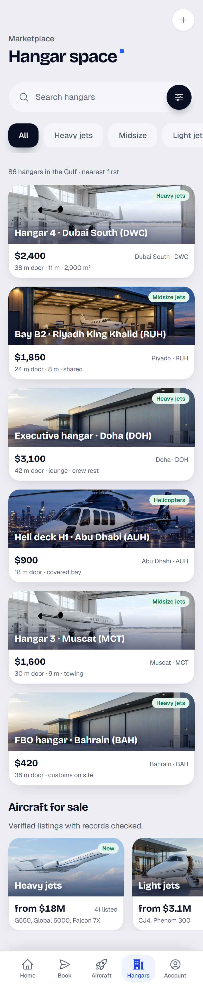
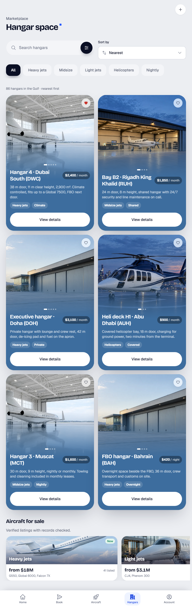
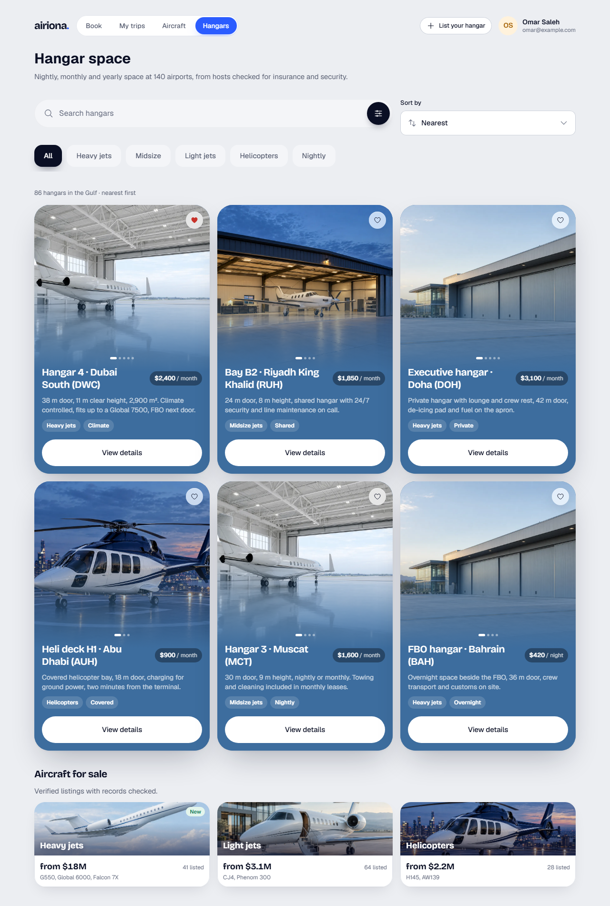
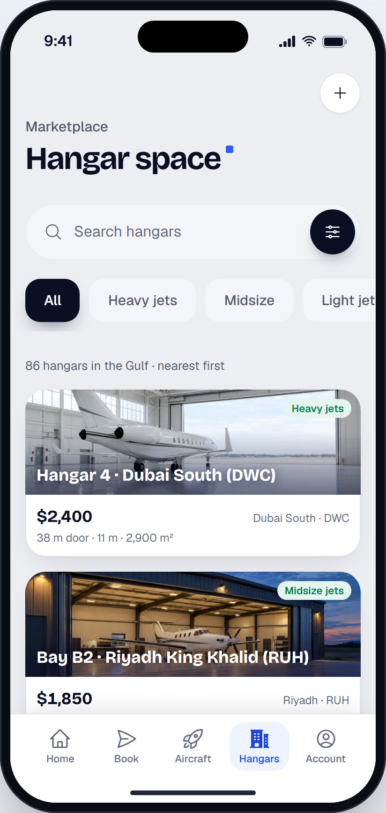

# Hangars

> Generated from `docs/pages/hangar-market/page.spec.json` by `node tools/page/airiona.mjs render hangar-market`. Edit the spec, not this file.

| | |
|---|---|
| Audience | An owner or a flight department manager looking for space for one aircraft, usually on a phone, checking door width, height and price first. |
| Primary action | Open a hangar listing |
| Source | brief · `product brief: Airiona aircraft and hangar marketplaces` |
| Route | `/hangar-market` (playground: `#/hangar-market`) |
| Framework | angular |

A listing page for the hangars marketplace. No design source: built from the product brief with the system's listing cards, mobile first, as a phone app tab with a desktop layout at 1280.

## Screens

| 390 px (phone) | 768 px (tablet) | 1280 px (desktop) |
|---|---|---|
|  |  |  |

App view (the page in app mode inside the phone frame, `#/native/hangar-market`):



Page checks (`shoot`): 0 errors, 0 warnings. Spec check (`lint`) is at the end of this document.

## Layout, mobile first

| Section | Purpose | 390 | 768 | 1280 | Sticky | Notes |
|---|---|---|---|---|---|---|
| **Site navigation** `nav` | Desktop navigation: the product destinations and the signed-in account | stack | ↑ | ↑ |  | hidden at base |
| **Hangars** `topbar` | Phone title and the sell action | stack | ↑ | ↑ |  | hidden at lg |
| **Hangar space** `head` | Desktop page title and intro | stack | ↑ | ↑ |  | hidden at base |
| **Search and filters** `filters` | Narrow the list: free text, category and sort order | stack | grid-2 | grid-3 |  |  |
| **Hangars listings** `results` | The listings | stack | grid-2 | grid-3 |  |  |
| **Aircraft for sale** `cross` | Cross-sell into the other marketplace | peek | ↑ | grid-3 |  |  |
| **Tabs** `tabs` | Phone and tablet app navigation, always in thumb reach | stack | ↑ | ↑ | base: bottom, lg: none | hidden at lg |

## Components

### Site navigation

| Element | Component | Inputs | Data | Why this one | States |
|---|---|---|---|---|---|
| `topNav` | TopNav `ar-top-nav` | `links`=[{"value":"book","label":"Book"},{"value":"trips","label":"M<br>`value`=hangars<br>`user`={"name":"Omar Saleh","email":"omar@example.com"} |  | The product's four destinations with the signed-in account; replaces the phone tab bar at 1280 |  |
| `navAction` [arActions] | Button `button[arButton], a[arButton]` | `variant`=secondary<br>`size`=sm<br>`iconStart`=plus |  | Hangar hosts are the supply side; listing space stays one tap away |  |

### Hangars

| Element | Component | Inputs | Data | Why this one | States |
|---|---|---|---|---|---|
| `appBar` | AppBar `ar-app-bar` | `title`=Hangar space<br>`large`=true<br>`eyebrow`=Marketplace<br>`accent`=true |  | Root screen of a tab: large title, which is the page h1 on phones and tablets |  |
| `appBarAction` [arActions] | IconButton `button[arIconButton]` | `icon`=plus<br>`label`=List your hangar<br>`variant`=surface |  | The sell/list action in one tap |  |

### Hangar space

| Element | Component | Inputs | Data | Why this one | States |
|---|---|---|---|---|---|
| `desktopTitle` | `<h1>` |  |  |  |  |
| `desktopIntro` | `<p>` |  |  |  |  |

### Search and filters

| Element | Component | Inputs | Data | Why this one | States |
|---|---|---|---|---|---|
| `search` | SearchField `ar-search-field` | `placeholder`=Search hangars<br>`label`=Search hangars<br>`showFilter`=true<br>`filterLabel`=More filters |  | Filled search with the filter button that opens the full filter sheet (price, year, location) |  |
| `sort` | Select `ar-select` | `label`=Sort by<br>`options`=[{"value":"near","label":"Nearest"},{"value":"price-asc","la<br>`value`=near<br>`iconStart`=arrows-up-down |  | Sort order is one choice from four; a Select keeps it compact on phones |  |
| `category` | ChipScroller `ar-chip-scroller` | `options`=[{"value":"all","label":"All"},{"value":"heavy","label":"Hea<br>`value`=all<br>`label`=Category |  | Categories as one swipeable row of chips: always visible, one tap to switch |  |

### Hangars listings

| Element | Component | Inputs | Data | Why this one | States |
|---|---|---|---|---|---|
| `resultCount` | `<h2>` |  |  |  |  |
| `listing` | StayCard `ar-stay-card` | `cta`=View details | `title` ← `item.title`<br>`price` ← `item.price`<br>`unit` ← `item.unit`<br>`description` ← `item.description`<br>`tags` ← `item.tags`<br>`image` ← `item.image`<br>`photos` ← `item.photos`<br>`saved` ← `item.saved` | A tall photo card with title, three-line description, two tags and a price with one action: the system card for a priced listing<br>Not DestinationCard: rating and Book now, for places<br>Not MiniDestination: too small for a listing that costs millions |  |
| `listingPhone` | MiniDestination `ar-mini-destination` |  | `title` ← `item.title`<br>`image` ← `item.image`<br>`price` ← `item.price`<br>`duration` ← `item.base`<br>`dates` ← `item.facts`<br>`badge` ← `item.tags[0]` | On phones a listing is a compact photo card with the name, price, base and three facts, the app feed pattern; the tall StayCard returns from tablets up<br>Not StayCard: about 550px tall at 390px wide: one listing per screen |  |

### Aircraft for sale

| Element | Component | Inputs | Data | Why this one | States |
|---|---|---|---|---|---|
| `crossTile` | MiniDestination `ar-mini-destination` |  | `title` ← `item.title`<br>`image` ← `item.image`<br>`price` ← `item.price`<br>`duration` ← `item.duration`<br>`dates` ← `item.dates`<br>`badge` ← `item.badge` | Compact photo cards that peek on phones; a door into the other marketplace |  |

### Tabs

| Element | Component | Inputs | Data | Why this one | States |
|---|---|---|---|---|---|
| `tabBar` | TabBar `ar-tab-bar` | `items`=[{"value":"home","label":"Home","icon":"home"},{"value":"boo<br>`value`=hangars<br>`variant`=labels<br>`label`=Main |  | Root screens of a phone app get a bottom tab bar; labels make five destinations unambiguous |  |

## Data

- **hangars**: `Listing[]` from GET /api/hangars?size&sort&q&near (24 per page). Loading: Six StayCard skeletons in the grid. Empty: Nothing matches these filters. Clear a filter or widen the search.. Error: Inline error with Retry; filters stay as they were.
- **aircraftTiles**: `Tile[]` from GET /api/featured (three tiles from the other marketplace). Loading: Three MiniDestination skeletons. Empty: Section hidden. Error: Section hidden; the listings above still work.

```ts
interface Listing {
  id: string;
  facts: string;
  base: string;
  title: string;
  price: string;
  unit: string;
  description: string;
  tags: string[];
  image: string;
  photos: number;
  saved: boolean;
}
interface Tile {
  title: string;
  image: string;
  price: string;
  duration: string;
  dates: string;
  badge: string?;
}
```

Sample data: `projects/playground/src/app/pages/hangar-market/hangar-market.data.ts`.

## Motion

| Where | Use | Why |
|---|---|---|
| Opening a listing | RouteTransition (shared-axis-x) | List to detail is forward navigation inside the same tab |

Everything settles instantly under `prefers-reduced-motion` or `provideAiriona({ motion: 'reduce' })`.

## Accessibility

- One h1: "Hangar space" (the AppBar title on phones and tablets, the desktop heading at 1280).
- Listing cards are articles with an h3 title; View details names the listing for screen readers via the card title.
- The category chips are a labelled group; the selected chip has aria-pressed.
- The tab bar is a nav landmark labelled Main, hidden at 1280 where the top navigation takes over.

## Notes

- Door width and clear height decide whether an aircraft fits; they lead each description.
- Nightly prices are for overnight stays (FBO hangars); everything else is monthly.
- Phones get the tab bar (Hangars selected); at 1280 the top navigation replaces it. On phones listings are compact MiniDestination cards and sorting lives in the filter sheet (the search field button).

## Spec check

✅ No errors


## Build it

```bash
node tools/page/airiona.mjs check hangar-market   # lint, handoff, scaffold, build, screenshots
npx ng serve playground                    # then open http://localhost:4200/#/hangar-market
```

Generated code: `projects/playground/src/app/pages/hangar-market/`. Copy that folder into the product app with `shared/page-form.ts` and `shared/validators.ts`, then replace the sample data with the real sources listed above.
