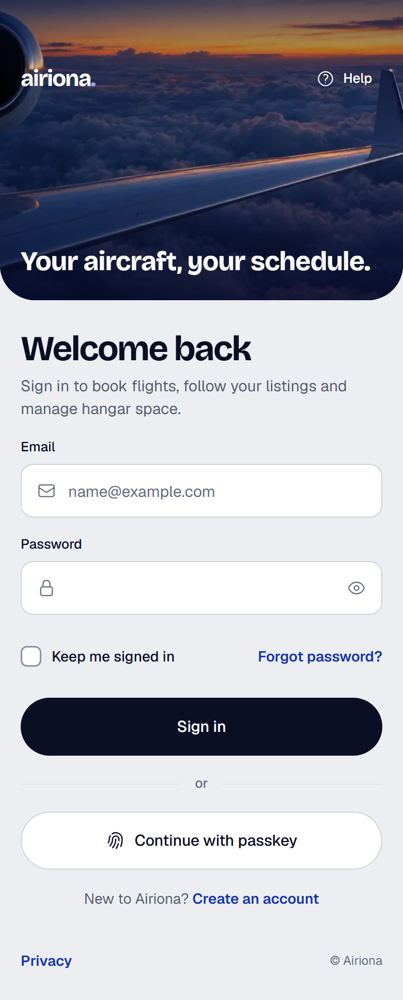
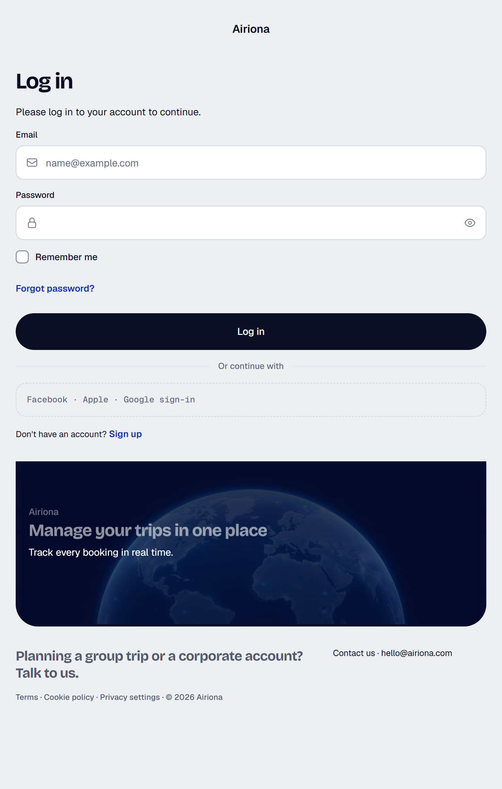
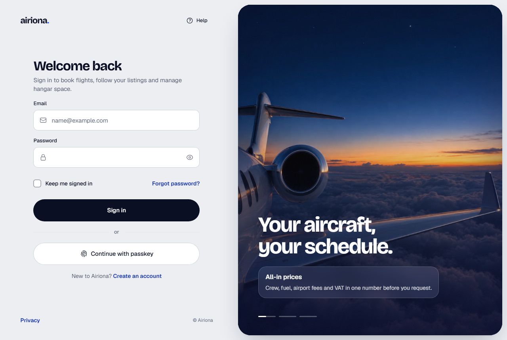
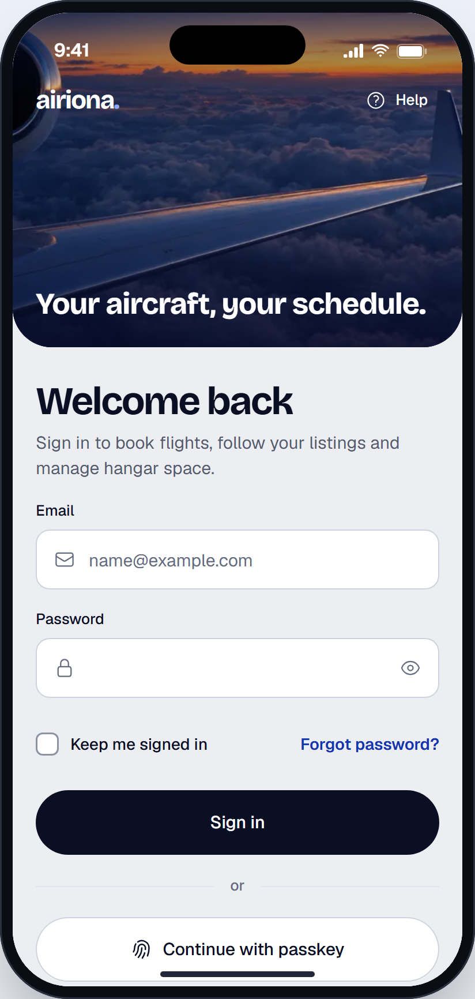

# Sign in

> Generated from `docs/pages/login/page.spec.json` by `node tools/page/airiona.mjs render login`. Edit the spec, not this file.

| | |
|---|---|
| Audience | A returning client, operator or hangar host signing in on a phone between flights or on a desktop at the office; they know their email and want to be through in under ten seconds. |
| Primary action | Sign in with email and password |
| Source | brief · `reference product sign-in screen (internal, not in this repository)` |
| Route | `/login` (playground: `#/login`) |
| Framework | angular |

The reference sign-in: a split screen with the form on one side and a looping cinematic panel on the other, highlight cards that rotate with progress ticks, a slim image strip on phones. Rebuilt in Airiona's light luxury style with the AuthShell component; copy and highlights are Airiona's (charter booking, aircraft marketplace, hangar space).

## Screens

| 390 px (phone) | 768 px (tablet) | 1280 px (desktop) |
|---|---|---|
|  |  |  |

App view (the page in app mode inside the phone frame, `#/native/login`):



Page checks (`shoot`): 0 errors, 0 warnings. Spec check (`lint`) is at the end of this document.

## Layout, mobile first

| Section | Purpose | 390 | 768 | 1280 | Sticky | Notes |
|---|---|---|---|---|---|---|
| **Sign in** `auth` | The whole screen: brand, form and the media panel | stack | ↑ | ↑ |  |  |

## Components

### Sign in

| Element | Component | Inputs | Data | Why this one | States |
|---|---|---|---|---|---|
| `shell` | AuthShell `ar-auth-shell` | `headline`=Your aircraft, your schedule.<br>`highlights`=[{"title":"All-in prices","text":"Crew, fuel, airport fees a<br>`side`=left<br>`mediaLabel`=About Airiona<br>`poster`=assets/photos/aviation/auth-wing.webp<br>`video`=assets/video/auth-wing.mp4<br>`stripImage`=assets/photos/aviation/auth-wing-strip.webp |  | The reference product's split-screen sign-in, in Airiona: the form column beside a cinematic media panel (poster, looping video after load, scrim, grain, rotating highlight cards with progress ticks that pause on hover or focus); a slim photo strip on phones<br>Not section split with HeroHeader: the old login: a mobile header stretched into an aside, no motion, no highlights, and the art fell below the form on phones<br>Not OnboardingFlow: a multi-step carousel for first launch, not a sign-in screen |  |
| `help` [arActions] | Button `button[arButton], a[arButton]` | `variant`=ghost<br>`size`=sm<br>`iconStart`=question-mark-circle |  | Help stays one tap away without competing with the form |  |
| `privacy` [arFoot] | `<a>` |  |  |  |  |
| `head` | `<div>` |  |  |  |  |
| `title` | `<h1>` |  |  |  |  |
| `lede` | `<p>` |  |  |  |  |
| `email` (field `email`) | TextField `ar-text-field` |  |  | Email with the envelope icon, email keyboard and autofill |  |
| `password` (field `password`) | TextField `ar-text-field` |  |  | Password with the built-in show/hide toggle and current-password autofill |  |
| `options` | `<div>` |  |  |  |  |
| `remember` (field `remember`) | Checkbox `ar-checkbox` |  |  | Optional; keeps the session for 30 days |  |
| `forgot` | `<a>` |  |  |  |  |
| `submit` | Button `button[arButton], a[arButton]` | `variant`=primary<br>`size`=lg<br>`block`=true |  | The one primary action, full width, midnight ink |  |
| `or` | `<p>` |  |  |  |  |
| `passkey` | Button `button[arButton], a[arButton]` | `variant`=secondary<br>`size`=lg<br>`block`=true<br>`iconStart`=finger-print<br>`type`=button |  | Passkeys are the fastest sign-in on phones; secondary so the form stays the default |  |
| `switch` | `<p>` |  |  |  |  |
| `signupLink` | `<a>` |  |  |  |  |

## Forms and validation

### login

Submit: **Sign in** → POST /api/auth/session { email, password, remember }. Success: navigate. Failure: 401: danger Toast 'That email and password don't match.' and clear only the password; 429: Toast 'Too many tries. Wait a minute and try again.' with the button disabled for the wait.

Errors show after a field is left or on submit; submit focuses the first invalid field.

| Field | Control | Default | Rules | Messages | Keyboard / autofill |
|---|---|---|---|---|---|
| **Email** `email` | TextField |  | required, email, maxLength(254) | required: “Enter your email.”<br>email: “Enter an email like name@example.com.”<br>maxLength: “Emails are at most 254 characters.” | type=email, autocomplete=email, inputMode=email |
| **Password** `password` | TextField |  | required, minLength(8) | required: “Enter your password.”<br>minLength: “Passwords are at least 8 characters.” | type=password, autocomplete=current-password |
| **Keep me signed in** `remember` | Checkbox | false |  |  |  |

## Motion

| Where | Use | Why |
|---|---|---|
| Moving between sign-in and sign-up | RouteTransition (fade-through) | The two screens are siblings; the form column swaps sides, so a fade-through reads as the card turning over rather than a slide |

Everything settles instantly under `prefers-reduced-motion` or `provideAiriona({ motion: 'reduce' })`.

## Accessibility

- One h1: "Welcome back". The media headline and highlight cards are paragraphs; inactive cards are aria-hidden so a screen reader hears only the current one.
- The highlight ticks are buttons named "Show highlight 2 of 3: …"; rotation pauses while focus is in the form or the pointer is on the panel.
- The video is decorative (aria-hidden, muted, no PiP), starts 1200ms after load on wide screens only, and never plays under prefers-reduced-motion.
- After an empty submit, focus moves to the first invalid field and each field shows its message (page-form.ts).

## Notes

- No sticky bottom bar: the form is one short column and the Sign in button is on the first phone screen (answers the lint warning about sticky.base bottom).
- The phone strip is a 176px crop of the same photo with the headline on it, so the brand moment survives on small screens without pushing the form below the fold.
- Passkey sign-in is a separate flow (WebAuthn); the button is type="button" so it never submits the form.

## Spec check

✅ No errors

- ⚠️ sections: a page with a form usually keeps its primary action reachable on phones: a section with sticky.base "bottom" (StickyActionBar)

## Build it

```bash
node tools/page/airiona.mjs check login   # lint, handoff, scaffold, build, screenshots
npx ng serve playground                    # then open http://localhost:4200/#/login
```

Generated code: `projects/playground/src/app/pages/login/`. Copy that folder into the product app with `shared/page-form.ts` and `shared/validators.ts`, then replace the sample data with the real sources listed above.
