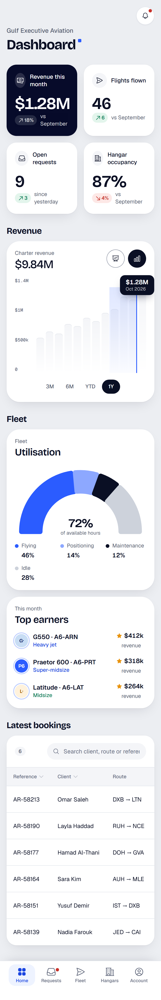
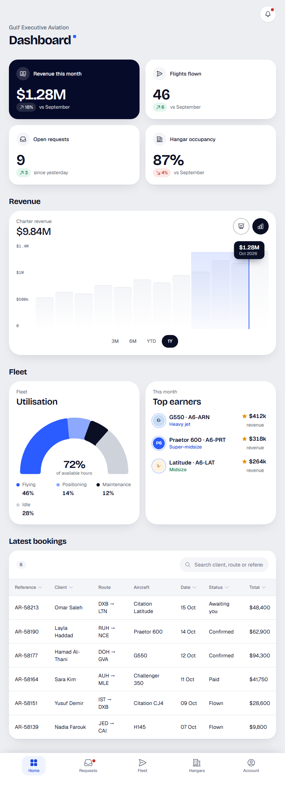
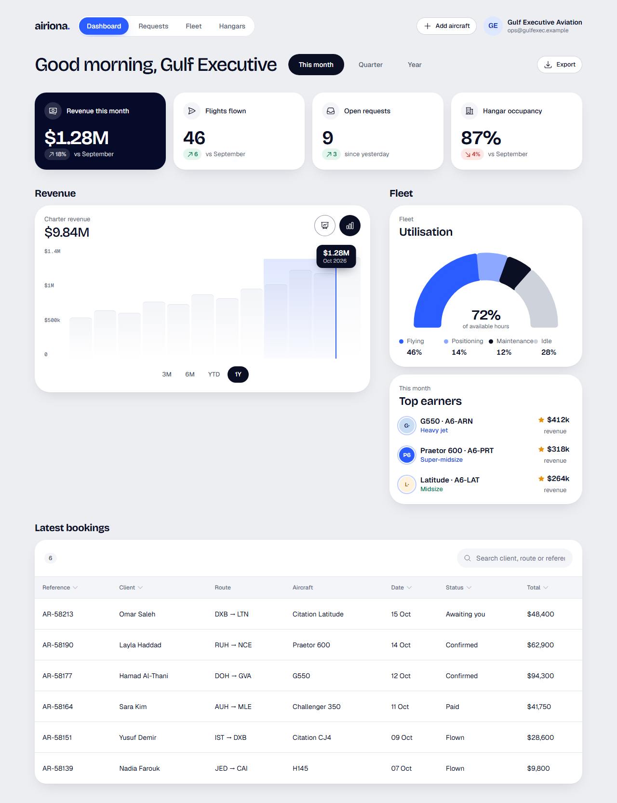
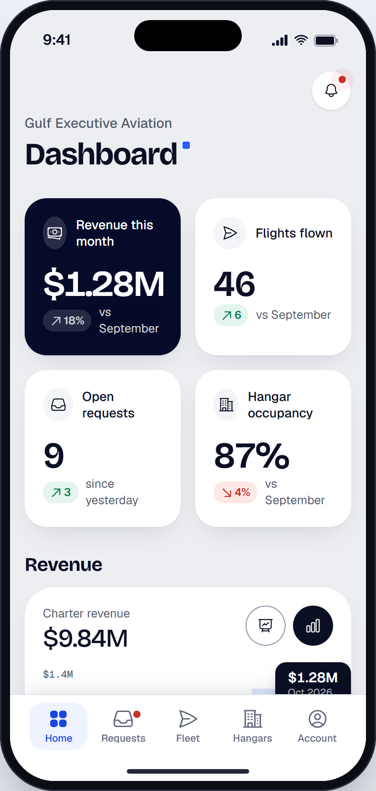

# Operator dashboard

> Generated from `docs/pages/operator-dashboard/page.spec.json` by `node tools/page/airiona.mjs render operator-dashboard`. Edit the spec, not this file.

| | |
|---|---|
| Audience | An operator or flight department manager checking the business on a phone in the morning and at a desk later; they look for what needs action first (new requests), then money. |
| Primary action | Open a booking that needs action |
| Source | brief · `product brief: Airiona operator side` |
| Route | `/operator-dashboard` (playground: `#/operator-dashboard`) |
| Framework | angular |

The home screen for an operator who charters, sells and hosts on Airiona: this month in numbers, revenue, fleet use, the latest bookings and the best-earning aircraft. No design source; built mobile first with the dashboard widgets.

## Screens

| 390 px (phone) | 768 px (tablet) | 1280 px (desktop) |
|---|---|---|
|  |  |  |

App view (the page in app mode inside the phone frame, `#/native/operator-dashboard`):



Page checks (`shoot`): 0 errors, 0 warnings. Spec check (`lint`) is at the end of this document.

## Layout, mobile first

| Section | Purpose | 390 | 768 | 1280 | Sticky | Notes |
|---|---|---|---|---|---|---|
| **Site navigation** `nav` | Desktop navigation: the product destinations and the signed-in account | stack | ↑ | ↑ |  | hidden at base |
| **Dashboard** `topbar` | Phone title with the operator name | stack | ↑ | ↑ |  | hidden at lg |
| **Dashboard** `head` | Desktop page header with period tabs | stack | ↑ | ↑ |  | hidden at base |
| **This month** `kpis` | Four numbers that sum up the month | grid-2 | ↑ | grid-4 |  |  |
| **Revenue** `revenue` | Charter and hangar revenue over the year | stack | ↑ | ↑ |  |  |
| **Fleet** `fleet` | How hard the fleet works; beside the chart on desktop | stack | grid-2 | stack (aside) |  |  |
| **Latest bookings** `bookings` | What needs action and what is coming | stack | ↑ | ↑ |  |  |
| **Tabs** `tabs` | Phone and tablet app navigation, always in thumb reach | stack | ↑ | ↑ | base: bottom, lg: none | hidden at lg |

## Components

### Site navigation

| Element | Component | Inputs | Data | Why this one | States |
|---|---|---|---|---|---|
| `topNav` | TopNav `ar-top-nav` | `links`=[{"value":"dashboard","label":"Dashboard"},{"value":"request<br>`value`=dashboard<br>`user`={"name":"Gulf Executive Aviation","email":"ops@gulfexec.exam |  | The product's four destinations with the signed-in account; replaces the phone tab bar at 1280 |  |
| `navAction` [arActions] | Button `button[arButton], a[arButton]` | `variant`=secondary<br>`size`=sm<br>`iconStart`=plus |  | Growing the fleet is the operator's main setup task |  |

### Dashboard

| Element | Component | Inputs | Data | Why this one | States |
|---|---|---|---|---|---|
| `appBar` | AppBar `ar-app-bar` | `title`=Dashboard<br>`large`=true<br>`eyebrow`=Gulf Executive Aviation<br>`accent`=true |  | Root screen of the Home tab: large title, the page h1 on phones |  |
| `bell` [arActions] | IconButton `button[arIconButton]` | `icon`=bell<br>`label`=Notifications, 3 new<br>`variant`=surface<br>`badge`=true |  | New requests and messages |  |

### Dashboard

| Element | Component | Inputs | Data | Why this one | States |
|---|---|---|---|---|---|
| `pageHeader` | PageHeader `ar-page-header` | `title`=Good morning, Gulf Executive<br>`tabs`=[{"value":"month","label":"This month"},{"value":"quarter","<br>`tab`=month |  | The dashboard header: title and period tabs |  |
| `export` [arActions] | Button `button[arButton], a[arButton]` | `variant`=secondary<br>`size`=sm<br>`iconStart`=arrow-down-tray |  | Monthly report for the accountant |  |

### This month

| Element | Component | Inputs | Data | Why this one | States |
|---|---|---|---|---|---|
| `kpi` | StatCard `ar-stat-card` |  | `label` ← `item.label`<br>`value` ← `item.value`<br>`icon` ← `item.icon`<br>`delta` ← `item.delta`<br>`caption` ← `item.caption`<br>`tone` ← `item.tone` | Label, counted-up figure and a delta with what it is compared to |  |

### Revenue

| Element | Component | Inputs | Data | Why this one | States |
|---|---|---|---|---|---|
| `revenueChart` | BalanceChart `ar-balance-chart` | `label`=Charter revenue<br>`value`=$9.84M<br>`bars`=[520,610,580,720,690,810,760,880,940,1120,1080,1280]<br>`max`=1400<br>`yLabels`=["$1.4M","$1M","$500k","0"]<br>`selection`=[8,11]<br>`tooltip`={"value":"$1.28M","date":"Oct 2026"}<br>`ranges`=["3M","6M","YTD","1Y"]<br>`range`=1Y<br>`ariaLabel`=Charter revenue by month, last 12 months |  | One figure, monthly bars and range tabs: the system revenue widget |  |

### Fleet

| Element | Component | Inputs | Data | Why this one | States |
|---|---|---|---|---|---|
| `utilisation` | SegmentGauge `ar-segment-gauge` | `eyebrow`=Fleet<br>`title`=Utilisation<br>`total`=72%<br>`totalLabel`=of available hours<br>`segments`=[{"label":"Flying","value":46,"display":"46%"},{"label":"Pos<br>`ariaLabel`=Fleet utilisation: 72% of available hours |  | Four parts of one whole around a counted-up total |  |
| `topAircraft` | Leaderboard `ar-leaderboard` | `eyebrow`=This month<br>`title`=Top earners<br>`items`=[{"name":"G550 · A6-ARN","role":"Heavy jet","score":"$412k",<br>`ariaLabel`=Top earning aircraft this month |  | Ranked list of three with a figure each |  |

### Latest bookings

| Element | Component | Inputs | Data | Why this one | States |
|---|---|---|---|---|---|
| `bookingTable` | DataTable `ar-data-table` | `caption`=Newest first. Awaiting you means the client is waiting for y<br>`searchable`=true<br>`searchPlaceholder`=Search client, route or reference<br>`clickableRows`=true<br>`columns`=[{"key":"id","header":"Reference","sortable":true},{"key":"c | `rows` ← `bookings` | Sortable, searchable table that scrolls sideways on phones; rows open the booking |  |

### Tabs

| Element | Component | Inputs | Data | Why this one | States |
|---|---|---|---|---|---|
| `tabBar` | TabBar `ar-tab-bar` | `items`=[{"value":"dashboard","label":"Home","icon":"squares-2x2"},{<br>`value`=dashboard<br>`variant`=labels<br>`label`=Main |  | Root screens of a phone app get a bottom tab bar; labels make five destinations unambiguous |  |

## Data

- **kpis**: `Kpi[]` from GET /api/operator/summary?month=2026-10. Loading: Four StatCard skeletons. Empty: Zeros with the caption "No activity yet this month". Error: Inline error with Retry.
- **bookings**: `Booking[]` from GET /api/operator/bookings?status=all&limit=8. Loading: Table skeleton, six rows. Empty: No bookings yet this month.. Error: Inline error with Retry.

```ts
interface Kpi {
  label: string;
  value: string;
  icon: string;
  delta: string;
  caption: string;
  tone: 'surface' | 'ink' | 'brand';
}
interface Booking {
  id: string;
  client: string;
  route: string;
  aircraft: string;
  date: string;
  status: string;
  total: string;
}
```

Sample data: `projects/playground/src/app/pages/operator-dashboard/operator-dashboard.data.ts`.

## Motion

| Where | Use | Why |
|---|---|---|
| Arriving from the tab bar | RouteTransition (fade-through) | Top-level destination |

Everything settles instantly under `prefers-reduced-motion` or `provideAiriona({ motion: 'reduce' })`.

## Accessibility

- One h1: the AppBar title on phones and tablets, the PageHeader title at 1280.
- Charts have an aria-label that states the figure; bars are decorative.
- The bookings table has a caption explaining the statuses; sortable headers announce their sort direction.

## Notes

- Phone order: KPIs (2×2), revenue, fleet, bookings, then the tab bar. Desktop puts fleet beside revenue and the table full width.
- Status text is plain in this sample; in the product app use an arCell template with a Badge per status.

## Spec check

✅ No errors


## Build it

```bash
node tools/page/airiona.mjs check operator-dashboard   # lint, handoff, scaffold, build, screenshots
npx ng serve playground                    # then open http://localhost:4200/#/operator-dashboard
```

Generated code: `projects/playground/src/app/pages/operator-dashboard/`. Copy that folder into the product app with `shared/page-form.ts` and `shared/validators.ts`, then replace the sample data with the real sources listed above.
