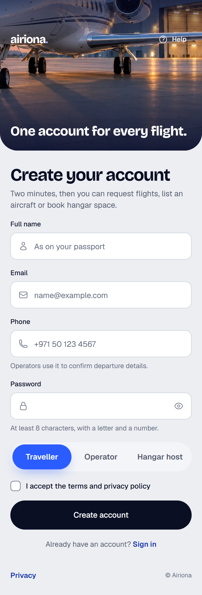
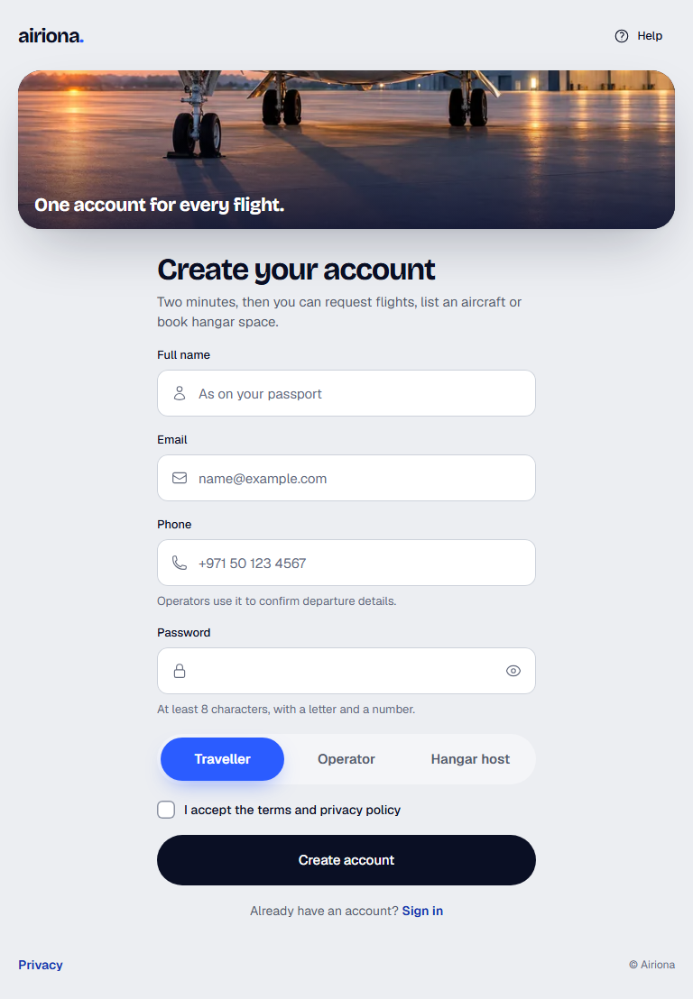
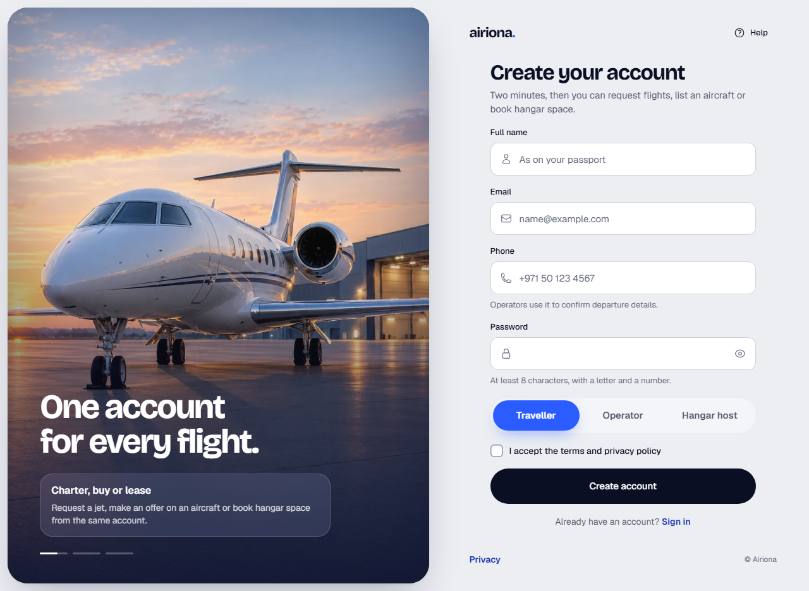
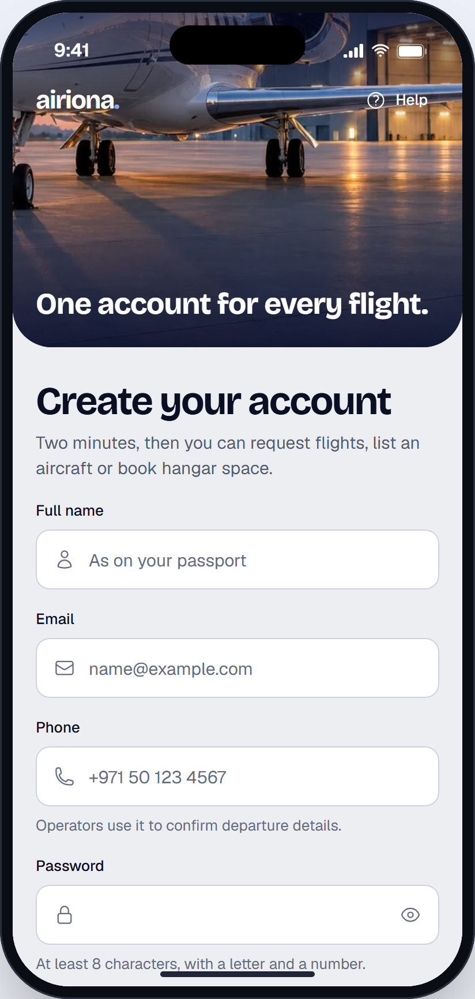

# Create account

> Generated from `docs/pages/signup/page.spec.json` by `node tools/page/airiona.mjs render signup`. Edit the spec, not this file.

| | |
|---|---|
| Audience | A first-time visitor who came from a listing, a charter quote or the home page, usually on a phone; they will give a name, email, phone and password if the form is short and tells them why each is needed. |
| Primary action | Create an account |
| Source | brief · `docs/pages/login/page.spec.json` |
| Route | `/signup` (playground: `#/signup`) |
| Framework | angular |

Sign-up uses the same AuthShell layout as sign-in with the form on the right, a different photo (the apron at dusk) and highlights for new members. Fields come from the product: name, email, phone, password, account type (traveller, operator, hangar host) and terms.

## Screens

| 390 px (phone) | 768 px (tablet) | 1280 px (desktop) |
|---|---|---|
|  |  |  |

App view (the page in app mode inside the phone frame, `#/native/signup`):



Page checks (`shoot`): 0 errors, 0 warnings. Spec check (`lint`) is at the end of this document.

## Layout, mobile first

| Section | Purpose | 390 | 768 | 1280 | Sticky | Notes |
|---|---|---|---|---|---|---|
| **Create account** `auth` | The whole screen: brand, form and the media panel | stack | ↑ | ↑ |  |  |

## Components

### Create account

| Element | Component | Inputs | Data | Why this one | States |
|---|---|---|---|---|---|
| `shell` | AuthShell `ar-auth-shell` | `headline`=One account for every flight.<br>`highlights`=[{"title":"Charter, buy or lease","text":"Request a jet, mak<br>`side`=right<br>`mediaLabel`=About Airiona<br>`poster`=assets/photos/aviation/auth-apron.webp<br>`stripImage`=assets/photos/aviation/auth-apron-strip.webp |  | The reference product's split-screen sign-in, in Airiona: the form column beside a cinematic media panel (poster, looping video after load, scrim, grain, rotating highlight cards with progress ticks that pause on hover or focus); a slim photo strip on phones<br>Not section split with HeroHeader: the old login: a mobile header stretched into an aside, no motion, no highlights, and the art fell below the form on phones<br>Not OnboardingFlow: a multi-step carousel for first launch, not a sign-in screen |  |
| `help` [arActions] | Button `button[arButton], a[arButton]` | `variant`=ghost<br>`size`=sm<br>`iconStart`=question-mark-circle |  | Help stays one tap away without competing with the form |  |
| `privacy` [arFoot] | `<a>` |  |  |  |  |
| `head` | `<div>` |  |  |  |  |
| `title` | `<h1>` |  |  |  |  |
| `lede` | `<p>` |  |  |  |  |
| `fullName` (field `fullName`) | TextField `ar-text-field` |  |  | One name field: no first/last split, which fails for many names |  |
| `email` (field `email`) | TextField `ar-text-field` |  |  | Sign-in identifier and where confirmations go |  |
| `phone` (field `phone`) | TextField `ar-text-field` |  |  | Operators call to confirm departure details; the hint says so |  |
| `password` (field `password`) | TextField `ar-text-field` |  |  | New password with the rule stated before the user types, not after |  |
| `accountType` (field `accountType`) | MobileSegmented `ar-mobile-segmented` |  |  | Three always-visible roles in one tap; changes what the dashboard shows first<br>Not Select: hides three short options behind a tap |  |
| `terms` (field `terms`) | Checkbox `ar-checkbox` |  |  | Required consent, unticked by default |  |
| `submit` | Button `button[arButton], a[arButton]` | `variant`=primary<br>`size`=lg<br>`block`=true |  | The one primary action |  |
| `switch` | `<p>` |  |  |  |  |
| `loginLink` | `<a>` |  |  |  |  |

## Forms and validation

### signup

Submit: **Create account** → POST /api/accounts { fullName, email, phone, password, accountType, terms }. Success: burst (“Welcome to Airiona”). Failure: 409 (email exists): message under Email 'An account with this email exists. Sign in instead.'; 422: messages under the fields the server names; network: danger Toast with Retry and the form stays filled.

Errors show after a field is left or on submit; submit focuses the first invalid field.

| Field | Control | Default | Rules | Messages | Keyboard / autofill |
|---|---|---|---|---|---|
| **Full name** `fullName` | TextField |  | required, maxLength(80) | required: “Enter your name.”<br>maxLength: “Names are at most 80 characters.” | autocomplete=name |
| **Email** `email` | TextField |  | required, email, maxLength(254) | required: “Enter your email.”<br>email: “Enter an email like name@example.com.”<br>maxLength: “Emails are at most 254 characters.” | type=email, autocomplete=email, inputMode=email |
| **Phone** `phone` | TextField |  | required, phone | required: “Enter a phone number.”<br>phone: “Enter a number with its country code, like +971 50 123 4567.” | type=tel, autocomplete=tel, inputMode=tel |
| **Password** `password` | TextField |  | required, minLength(8), pattern(^(?=.*[A-Za-z])(?=.*\d).+$) | required: “Choose a password.”<br>minLength: “Use at least 8 characters.”<br>pattern: “Add at least one letter and one number.” | type=password, autocomplete=new-password |
| **I'm joining as** `accountType` | MobileSegmented | client | required | required: “Choose how you will use Airiona.” |  |
| **I accept the terms and privacy policy** `terms` | Checkbox | false | requiredTrue | requiredTrue: “Accept the terms to create your account.” |  |

## Motion

| Where | Use | Why |
|---|---|---|
| Moving between sign-in and sign-up | RouteTransition (fade-through) | The two screens are siblings; the form column swaps sides, so a fade-through reads as the card turning over rather than a slide |

Everything settles instantly under `prefers-reduced-motion` or `provideAiriona({ motion: 'reduce' })`.

## Accessibility

- One h1: "Create your account".
- Password rules are in the hint before typing, and the pattern message names what is missing.
- The account type group is labelled "I'm joining as"; arrow keys move between the three roles.
- The terms checkbox error is announced (role="alert") and focus moves to it on submit when it is the first invalid field.

## Notes

- No sticky bottom bar: the Create account button follows the last field and a sticky copy would cover the terms line (answers the lint warning about sticky.base bottom).
- Sign-up shows the poster without video: the apron photo has no loop yet; add `video` when one is cut (export the poster from its first frame).
- Operators and hangar hosts get a verification step after the first sign-in (certificates, insurance); it is not part of this form so the form stays short.

## Spec check

✅ No errors

- ⚠️ sections: a page with a form usually keeps its primary action reachable on phones: a section with sticky.base "bottom" (StickyActionBar)

## Build it

```bash
node tools/page/airiona.mjs check signup   # lint, handoff, scaffold, build, screenshots
npx ng serve playground                    # then open http://localhost:4200/#/signup
```

Generated code: `projects/playground/src/app/pages/signup/`. Copy that folder into the product app with `shared/page-form.ts` and `shared/validators.ts`, then replace the sample data with the real sources listed above.
