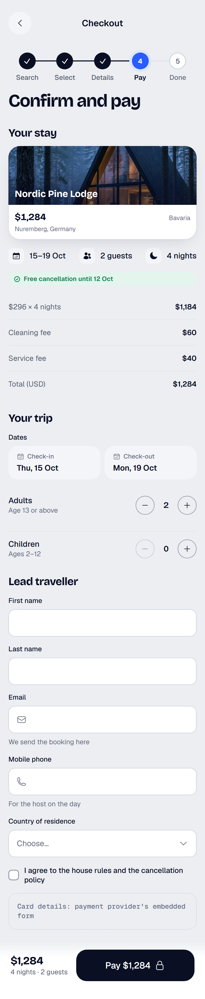
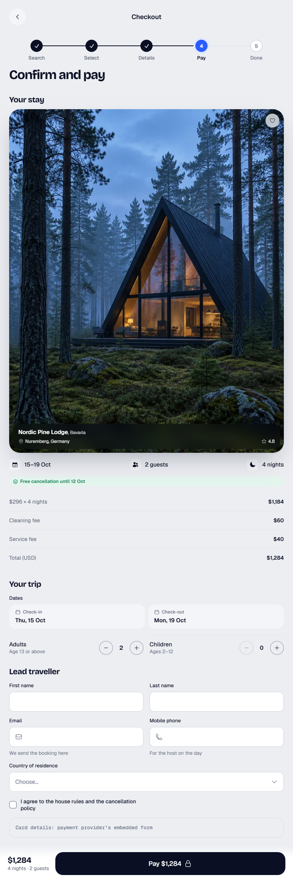
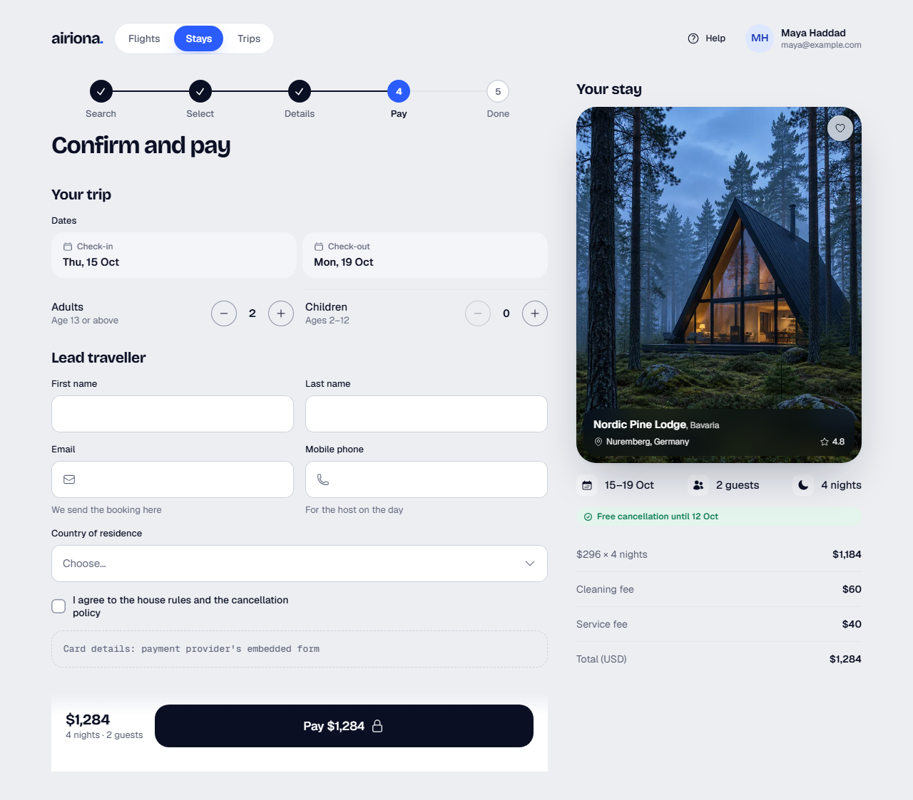
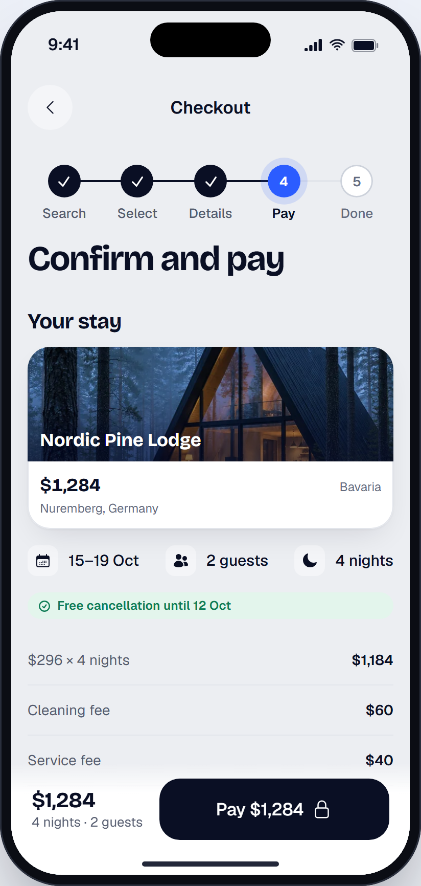

# Stay checkout

> Generated from `docs/pages/stay-checkout/page.spec.json` by `node tools/page/airiona.mjs render stay-checkout`. Edit the spec, not this file.

| | |
|---|---|
| Audience | A traveller on a phone finishing a booking they already chose, often in a hurry and on mobile data |
| Primary action | Pay and confirm the stay |
| Source | brief |
| Route | `/stays/:id/checkout` (playground: `#/stay-checkout`) |
| Framework | angular |

Sample page: the last step of booking a stay. Traveller arrives from the stay page with dates and guests chosen, confirms them, enters the lead traveller's details and pays. Payment card entry is the provider's embedded UI (see gaps).

## Screens

| 390 px (phone) | 768 px (tablet) | 1280 px (desktop) |
|---|---|---|
|  |  |  |

App view (the page in app mode inside the phone frame, `#/native/stay-checkout`):



Page checks (`shoot`): 0 errors, 0 warnings. Spec check (`lint`) is at the end of this document.

## Layout, mobile first

| Section | Purpose | 390 | 768 | 1280 | Sticky | Notes |
|---|---|---|---|---|---|---|
| **Site navigation** `nav` | Desktop navigation | stack | ↑ | ↑ |  | hidden at base |
| **Checkout** `topbar` | Phone top bar with back to the stay | stack | ↑ | ↑ |  | hidden at lg |
| **Confirm and pay** `steps` | Where the traveller is in the booking, and the page title | stack | ↑ | ↑ |  |  |
| **Your stay** `summary` | What is being paid for; beside the form on desktop | stack | ↑ | ↑ (aside) |  |  |
| **Trip and traveller** `details` | Confirm dates and guests, then the lead traveller's details | stack | grid-2 | ↑ |  |  |
| **Pay** `pay` | The total and the pay button, always in reach on phones | stack | ↑ | ↑ | base: bottom, lg: none |  |

## Components

### Site navigation

| Element | Component | Inputs | Data | Why this one | States |
|---|---|---|---|---|---|
| `topNav` | TopNav `ar-top-nav` | `links`=[{"value":"flights","label":"Flights"},{"value":"stays","lab<br>`value`=stays<br>`user`={"name":"Maya Haddad","email":"maya@example.com"} |  | Desktop app navigation with the signed-in traveller |  |
| `navHelp` [arActions] | Button `button[arButton], a[arButton]` | `variant`=ghost<br>`size`=sm<br>`iconStart`=question-mark-circle |  | Replaces TopNav's default search and bell, which do not belong in checkout |  |

### Checkout

| Element | Component | Inputs | Data | Why this one | States |
|---|---|---|---|---|---|
| `appBar` | AppBar `ar-app-bar` | `title`=Checkout<br>`showBack`=true<br>`backLabel`=Back to the stay |  | Compact bar with back on a detail-level screen |  |

### Confirm and pay

| Element | Component | Inputs | Data | Why this one | States |
|---|---|---|---|---|---|
| `progress` | BookingSteps `ar-booking-steps` | `steps`=["Search","Select","Details","Pay","Done"]<br>`current`=3 |  | The checkout progress line from the system |  |
| `title` | `<h1>` |  |  |  |  |

### Your stay

| Element | Component | Inputs | Data | Why this one | States |
|---|---|---|---|---|---|
| `stayCard` | PlaceCard `ar-place-card` |  | `title` ← `stay.name`<br>`region` ← `stay.region`<br>`location` ← `stay.location`<br>`rating` ← `stay.rating`<br>`image` ← `stay.image` | The stay as the traveller saw it on the listing: photo, name, place, rating<br>Not StayCard: a hero card with its own Reserve button; this page already has the pay action |  |
| `stayPhone` | MiniDestination `ar-mini-destination` |  | `title` ← `stay.name`<br>`image` ← `stay.image`<br>`price` ← `stay.total`<br>`duration` ← `stay.region`<br>`dates` ← `stay.location` | On phones the stay is a compact photo card with the name, total, region and place, so the trip and payment fields start on the first screen; the tall PlaceCard returns from tablets up<br>Not PlaceCard: about 400px tall on a phone: the whole first screen is a photo |  |
| `facts` | InfoStatRow `ar-info-stat-row` | `items`=[{"icon":"calendar-days","label":"15–19 Oct"},{"icon":"users |  | Three quick facts under the photo |  |
| `cancellation` | Badge `ar-badge` | `tone`=success<br>`icon`=check-circle |  | Reassurance right before paying; the success tone marks it as good news |  |
| `priceLines` | DetailList `ar-detail-list` |  | `items` ← `stay.priceLines` | Label and value rows for the price breakdown, total last |  |

### Trip and traveller

| Element | Component | Inputs | Data | Why this one | States |
|---|---|---|---|---|---|
| `tripHeading` | `<h2>` |  |  |  |  |
| `dates` (field `dates`) | DatePicker `ar-date-picker` | `mode`=range<br>`variant`=tiles<br>`startLabel`=Check-in<br>`endLabel`=Check-out<br>`min`=2026-10-04<br>`maxNights`=28 |  | Check-in and check-out side by side with the range calendar, the system's booking date control<br>Not Calendar: a full inline month takes the whole phone screen |  |
| `adults` (field `adults`) | QuantityStepper `ar-quantity-stepper` | `description`=Age 13 or above<br>`min`=1<br>`max`=8 |  | Counting guests with bounded minus and plus |  |
| `children` (field `children`) | QuantityStepper `ar-quantity-stepper` | `description`=Ages 2–12<br>`min`=0<br>`max`=6 |  | Same control as adults |  |
| `travellerHeading` | `<h2>` |  |  |  |  |
| `firstName` (field `firstName`) | TextField `ar-text-field` |  |  | Name as on the passport; given name and family name separate for autofill |  |
| `lastName` (field `lastName`) | TextField `ar-text-field` |  |  | Pairs with the given name on tablet and desktop |  |
| `email` (field `email`) | TextField `ar-text-field` | `iconStart`=envelope<br>`hint`=We send the booking here |  | Email keyboard and autofill |  |
| `phone` (field `phone`) | TextField `ar-text-field` | `iconStart`=phone<br>`hint`=For the host on the day |  | Phone keyboard and autofill |  |
| `country` (field `country`) | Select `ar-select` | `searchable`=true<br>`searchPlaceholder`=Search countries | `options` ← `countries` | One of many options; searchable |  |
| `terms` (field `terms`) | Checkbox `ar-checkbox` |  |  | Consent must be an explicit tick (requiredTrue) |  |
| `payment` | **GAP** |  |  |  |  |

### Pay

| Element | Component | Inputs | Data | Why this one | States |
|---|---|---|---|---|---|
| `payBar` | StickyActionBar `ar-sticky-action-bar` |  |  | The system's bottom CTA: price summary plus one 60px button<br>Not BookingBar: its action is not a form submit button |  |
| `payTotal` [arSummary] | `<strong>` |  |  |  |  |
| `payNights` [arSummary] | `<span>` |  |  |  |  |
| `payButton` | Button `button[arButton], a[arButton]` | `variant`=primary<br>`size`=lg<br>`iconEnd`=lock-closed |  | The single primary action; the verb and amount say exactly what happens |  |

## Forms and validation

### booking

Submit: **Pay $1,284** → POST /api/bookings { stayId, dates, adults, children, traveller, paymentIntentId }. Success: burst (“You're going to Bavaria”). Failure: Payment declined: danger Toast with the provider's message and the form kept; price changed (409): Dialog showing old and new total with Continue and Cancel.

Errors show after a field is left or on submit; submit focuses the first invalid field.

| Field | Control | Default | Rules | Messages | Keyboard / autofill |
|---|---|---|---|---|---|
| **Dates** `dates` | DatePicker | ["2026-10-15","2026-10-19"] | required, dateRange, futureDate | required: “Choose check-in and check-out.”<br>dateRange: “Check-out must be after check-in.”<br>futureDate: “Check-in can't be in the past.” |  |
| **Adults** `adults` | QuantityStepper | 2 | min(1) | min: “At least one adult has to stay.” |  |
| **Children** `children` | QuantityStepper | 0 |  |  |  |
| **First name** `firstName` | TextField |  | required, maxLength(60) | required: “Enter the first name as on the passport.”<br>maxLength: “Use at most 60 characters.” | autocomplete=given-name |
| **Last name** `lastName` | TextField |  | required, maxLength(60) | required: “Enter the last name as on the passport.”<br>maxLength: “Use at most 60 characters.” | autocomplete=family-name |
| **Email** `email` | TextField |  | required, email | required: “Enter your email so we can send the booking.”<br>email: “Enter an email like name@example.com.” | type=email, autocomplete=email, inputMode=email |
| **Mobile phone** `phone` | TextField |  | required, phone | required: “Enter a phone number the host can reach.”<br>phone: “Enter a phone number with country code, like +49 30 1234567.” | type=tel, autocomplete=tel, inputMode=tel |
| **Country of residence** `country` | Select |  | required | required: “Choose your country of residence.” |  |
| **I agree to the house rules and the cancellation policy** `terms` | Checkbox | false | requiredTrue | requiredTrue: “Tick to agree before paying.” |  |

## Data

- **stay**: `Stay` from GET /api/stays/:id/quote?checkIn&checkOut&adults&children. Loading: Skeleton in the shape of the stay card and price lines; the pay bar stays visible but disabled. Empty: —. Error: Toast with Retry; if the quote expired, an IllustrationCallout asking to pick dates again.
- **countries**: `Country[]` from static list (ISO 3166), most used first. Loading: n/a (bundled). Empty: n/a. Error: n/a.

```ts
interface PriceLine {
  label: string;
  value: string;
}
interface Stay {
  id: string;
  name: string;
  region: string;
  location: string;
  rating: string;
  image: string;
  nights: number;
  total: string;
  cancellation: string;
  priceLines: PriceLine[];
}
interface Country {
  value: string;
  label: string;
}
```

Sample data: `projects/playground/src/app/pages/stay-checkout/stay-checkout.data.ts`.

## Motion

| Where | Use | Why |
|---|---|---|
| Arriving from the stay page | RouteTransition (shared-x) | An ordered step forward in the booking flow |
| After payment succeeds | SuccessBurst | The one celebration at the end of the booking flow |

Everything settles instantly under `prefers-reduced-motion` or `provideAiriona({ motion: 'reduce' })`.

## Accessibility

- One h1 ('Confirm and pay'); 'Your stay', 'Your trip' and 'Lead traveller' are h2.
- The pay button names the amount; while paying it shows the loading state and stays focused.
- Errors appear under each field after it is left or on submit; submit moves focus to the first invalid field.

## Gaps

| Element | Need | Nearest today | Proposal |
|---|---|---|---|
| payment | Card entry (number, expiry, CVC) with 3-D Secure | TextField (must not be used for card data) | Embed the payment provider's UI (Stripe Payment Element) styled with Airiona tokens via its Appearance API; wrap it as an ar-payment-element component |

## Notes

- Phone order: steps and title, the stay summary, trip and traveller form, then the sticky pay bar. On desktop the summary moves to the right column and the pay button sits under the form.
- Dates and guests arrive prefilled from the stay page; changing them refreshes the quote (stay.total and price lines).
- The pay bar shows the current total; in the app it reads the same quote as the price lines.
- Phones show the stay as a compact MiniDestination card (photo, name, total, region, place); the tall PlaceCard is for tablets and desktop.

## Spec check

✅ No errors


## Build it

```bash
node tools/page/airiona.mjs check stay-checkout   # lint, handoff, scaffold, build, screenshots
npx ng serve playground                    # then open http://localhost:4200/#/stay-checkout
```

Generated code: `projects/playground/src/app/pages/stay-checkout/`. Copy that folder into the product app with `shared/page-form.ts` and `shared/validators.ts`, then replace the sample data with the real sources listed above.
